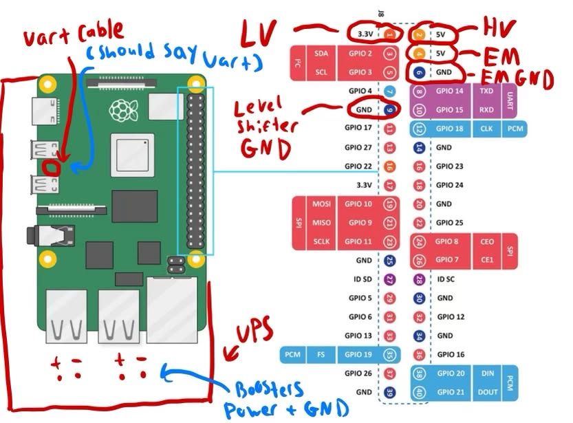
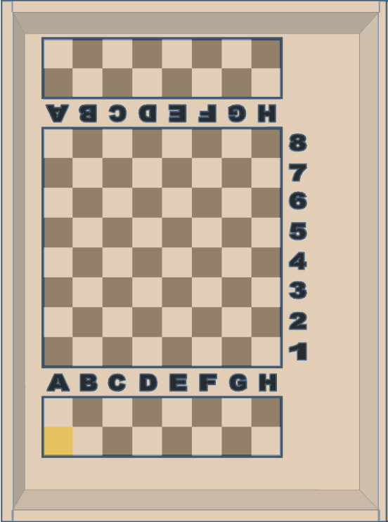

# Chess 2 Impress Instruction Manual 
This instruction manual will serve as a reference for starting up and maintaining our automated chess board. 

## Quick Startup Guide
1. Check and make sure that all cables on the Raspberry Pi/UPS are plugged in.
   This includes:
   - Booster wires
   - Uart Cable
   - All 4 USB Cables
   - Logic level converter and electromagnet cables (on Pi GPIO ports)
   - MicroHDMI cable for LCD screen

>Reference the troubleshooting section for a full diagram showing where everything should plug in.
  
2. Ensure that CoreXY is in correct position and electromagnet is all the way at home.
   - Electromagnet should be centered under the home square
   - CoreXY stand should line up with marks inside the base
  
>Reference the troubleshooting section for an image of the electromagnet home square.
3. Plug in LCD screen via HDMI and USB-C cables, then route screen through hole in acrylic.
4. Check that acrylic sheet is attached by all 4 corner screws.
5. Pull out USB coupler from board, press UPS power button one time, then reinsert USB coupler.
6. Check that UPS battery icons come on and that Raspberry Pi indicator light is green.
7. Plug microphone into USB coupler.
8. Screen should turn on and chess program should auto load. Follow prompts on LCD screen to play!

## Shutdown Guide
1. Say "Chess Resign" into the microphone and wait for the board to reset.
2. Once it is finished, say "Chess no" to tell the program to close.
3. Take all of the pieces off of the board, unplug LCD screen, unplug microphone, and put them away if chess board needs to be moved.
4. Take USB coupler out and press UPS power button 3 times to turn off.
5. Ensure that UPS charging light starts blinking red to show that it is charging.

## Diagrams and Troubleshooting
### Frequent Issues: 
__Software__
- __Issue__: The Pi is on but the screen will not turn on.
   - __Fix__: Make sure that both the HDMI and power cable to the LCD are plugged in well. If Pi stays on and LCD still does not turn on, try restarting the board.

- __Issue__: When I give the board a move, the motors do not move and the program goes to the next turn.
   - __Fix__: There is some issue with the arduino. Make sure that all of the GPIO pins are plugged in correctly and that both the UART and USB cables for the arduino are plugged in.

__Hardware__
- __Issue__: The belts on the CoreXY are making noise/slipping.
   - __Fix__: Turn off the board, manually move the CoreXY and see if it feels stuck/difficult to move the bar. Try to see if there is any part of the CoreXY that is rubbing against each other. Also measure both ends of the CoreXY and make sure that it is square. Otherwise, try retensioning the belts.

### Diagrams:

_Figure 1 - Raspberry Pi/UPS Wiring Diagram_

_Figure 2 - Electromagnet Home Square Example_
