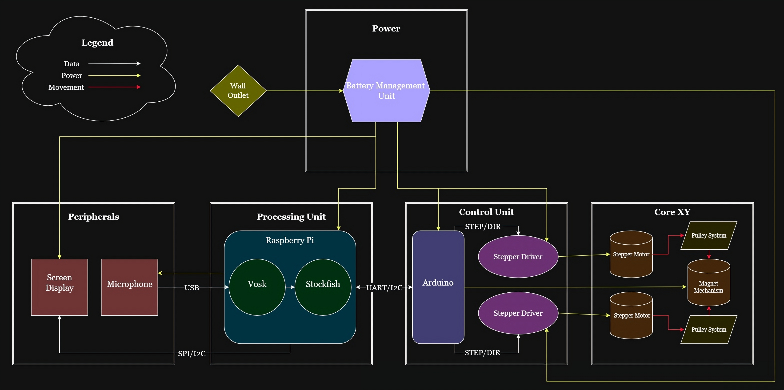

##CHANGE ME

# Conceptual Design

This document outlines the objectives of a conceptual design. After reading your conceptual design, the reader should understand:

- The fully formulated problem.
- The fully decomposed conceptual solution.
- Specifications for each of the atomic pieces of the solution.
- Any additional constraints and their origins.
- How the team will accomplish their goals given the available resources.

With these guidelines, each team is expected to create a suitable document to achieve the intended objectives and effectively inform their stakeholders.

## General Requirements for the Document
- Submissions must be composed in Markdown format. Submitting PDFs or Word documents is not permitted.
- All information that is not considered common knowledge among the audience must be properly cited.
- The document should be written in the third person.
- An introduction section should be included.
- The latest fully formulated problem must be clearly articulated using explicit "shall" statements.
- A comparative analysis of potential solutions must be performed
- The document must present a comprehensive, well-specified high-level solution.
- The solution must contain a hardware block diagram.
- The solution must contain an operational flowchart.
- For every atomic subsystem, a detailed functional description, inputs, outputs, and specifications must be provided.
- The document should include an acknowledgment of ethical, professional, and standards considerations, explaining the specific constraints imposed.
- The solution must include a refined estimate of the resources needed, including: costs, allocation of responsibilities for each subsystem, and a Gantt chart.

## Introduction

The introduction is intended to reintroduce the fully formulated problem. 

## Restating the Fully Formulated Problem

The fully formulated problem is the overall objective and scope complete with the set of shall statements. This was part of the project proposal. However, it may be that the scope has changed. So, state the fully formulated problem in the introduction of the conceptual design and planning document. For each of the constraints, explain the origin of the constraint (customer specification, standards, ethical concern, broader implication concern, etc).

## Comparative Analysis of Potential Solutions

In this section, various potential solutions are hypothesized, design considerations are discussed, and factors influencing the selection of a solution are outlined. The chosen solution is then identified with justifications for its selection.

## High-Level Solution

This section presents a high-level solution for the autonomous chessboard system, designed to meet all functional and performance requirements while adhering to practical hardware and software constraints. The system integrates mechanical motion, artificial intelligence, and voice recognition into a unified platform that enables users to play chess naturally through verbal commands. By coordinating the different sections of the chess board, the design achieves helpful communication, precise motion control, and user interaction. The accompanying block diagram illustrates how each subsystem contributes to the overall architecture through defined input-output relationships, such as power distribution and data flow. Meanwhile, the operational flowchart illustrates the sequence of system interactions, showing how changes in the chessboard’s state drive corresponding user inputs and system responses. This representation highlights the system’s flow, making sure of the communication between components while also minimizing latency, reducing processing overhead, and maintaining performance. Together, these design diagrams present a resource efficient solution that effectively balances system complexity, computational performance, and user experience.

### Hardware Block Diagram

#### Processing Unit
The Processing Unit will consist of a Raspberry Pi responsible for coordinating all high-level system operations. Its primary functions are fourfold. First, it will interpret incoming audio signals from the microphone using the Vosk speech recognition engine to convert spoken commands into recognizable text, while also supplying power to the microphone. Second, it will maintain the internal state of the chessboard and verify the legality of player moves using the Stockfish chess engine. Third, it will transmit validated and legal move commands to the Control Unit (Arduino) for conversion into motion control instructions. Lastly, the Raspberry Pi will send display data to the screen, providing the user with real-time visual feedback on system activity and game status.
#### Control Unit
The Control Unit will manage all motion control functions and serve as the intermediary between the Processing Unit and the mechanical subsystems. It will receive move instructions from the Raspberry Pi, interpret them into executable signals for the CoreXY motors, and transmit confirmation messages back to the Processing Unit. This will be achieved through the Arduino’s coordination of communication with stepper motor drivers housed within the Control Unit. The servo motor responsible for magnetic actuation will receive direct control signals from the Arduino to ensure precise vertical (Z-axis) movement.
#### Core XY Unit
The CoreXY Unit will execute all physical motion required to reposition chess pieces on the board. Upon receiving step and direction commands from the Control Unit, it will drive two stepper motors to manipulate belts and pulleys that move a magnetic carriage across the X and Y axes. A servo-driven magnet will function as the Z-axis actuator, enabling the magnet to raise and lower as needed. This mechanism minimizes magnetic interference with nearby pieces and prevents unintentional displacement during movement.
#### Peripherals Unit
The Peripherals Unit consists of the system’s input and output devices — the microphone and display screen. The microphone captures user voice commands, potentially supported by software-based noise filtering to improve accuracy and clarity. The display provides feedback to the player by showing system messages such as “Not a Legal Move” or “Pawn to A5”, as well as overall game status updates. Together, these peripherals form the user interface that enables intuitive interaction with the system.
#### Power Unit
The Power Unit supplies regulated electrical power to all other subsystems. It will consist of a battery-based power source designed to provide multiple voltage levels to meet the varying current and voltage requirements of each component. The 12V rail will supply power to the stepper motors and drivers, while the 5V rail will support the Raspberry Pi, Arduino, and other control and peripheral electronics. Proper power regulation and distribution are essential to ensure safe, stable, and efficient system operation.

### Operational Flow Chart

I WILL PUT DIAGRAM HERE

This diagram illustrates the overall operational flow of the automatic chessboard system, including both user interactions and the underlying processes required to generate the on-screen display. At startup, all hardware and software components initialize and configure their respective systems. Once initialization is complete, the display indicates that the board is ready for user input.

The user then provides a command, which the system processes to determine whether it represents a valid chess move. If the command is both recognized and legal, the system executes the move by physically repositioning the piece and updating the visual display to reflect the new board state.

Next, the opposing player (either the integrated AI engine or another human participant) takes a turn following the same sequence of validation, movement, and display update. This turn-based cycle continues until one player achieves checkmate. When the game concludes, the display presents the final result and the board automatically resets the pieces to their starting positions. Finally, the system prompts the user to decide whether to begin a new game.

## Atomic Subsystem Specifications

Based on the high-level design, provide a comprehensive description of the functions each subsection will perform.

Inclued a description of the interfaces between this subsystem and other subsystems:
- Give the type of signal (e.g. power, analog signal, serial communication, wireless communication, etc).
- Clearly define the direction of the signal (input or output).
- Document the communication protocols used.
- Specifying what data will be sent and what will be received.

Detail the operation of the subsystem:
- Illustrate the expected user interface, if applicable.
- Include functional flowcharts that capture the major sequential steps needed to achieve the desired functionalities.

For all subsystems, formulate detailed "shall" statements. Ensure these statements are comprehensive enough so that an engineer who is unfamiliar with your project can design the subsystem based on your specifications. Assume the role of the customer in this context to provide clear and precise requirements.

## Ethical, Professional, and Standards Considerations

In the project proposal, each team must evaluate the broader impacts of the project on culture, society, the environment, public health, public safety, and the economy. Additionally, teams must consider relevant standards organizations that will inform the design process. A comprehensive discussion should be included on how these considerations have influenced the design. This includes detailing constraints, specifications, and practices implemented as a result, and how these address the identified considerations.

## Resources

You have already estimated the resources needed to complete the solution. Now, let's refine those estimates.

### Budget

Develop a budget proposal with justifications for expenses associated with each subsystem. Note that the total of this budget proposal can also serve as a specification for each subsystem. After creating the budgets for individual subsystems, merge them to create a comprehensive budget for the entire solution.

### Division of Labor

First, conduct a thorough analysis of the skills currently available within the team, and then compare these skills to the specific requirements of each subsystem. Based on this analysis, appoint a team member to take the specifications for each subsystem and generate a corresponding solution (i.e. detailed design). If there are more team members than subsystems, consider further subdividing the solutions into smaller tasks or components, thereby allowing each team member the opportunity to design a subsystem.

### Timeline

Revise the detailed timeline (Gantt chart) you created in the project proposal. Ensure that the timeline is optimized for detailed design. Address critical unknowns early and determine if a prototype needs to be constructed before the final build to validate a subsystem. Additionally, if subsystem $A$ imposes constraints on subsystem $B$, generally, subsystem $A$ should be designed first.

## References

All sources utilized in the conceptual design that are not considered common knowledge must be properly cited. Multiple references should be included.

## Statement of Contributions

Each team member is required to make a meaningful contribution to the project proposal. In this section, each team member is required to document their individual contributions to the report. One team member may not record another member's contributions on their behalf. By submitting, the team certifies that each member's statement of contributions is accurate.
