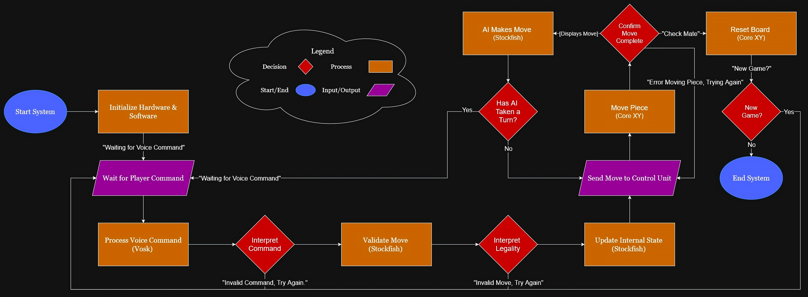

# Conceptual Design

## Introduction

Chess is a complex and strategic game that allows players to compete against each other on an even playing field with no hidden information. 
As it has grown more popular, new ways to enjoy this age old game have been developed. One of the most interesting examples of this is the automated chess board.
Automated chess boards are able to improve the user experience by changing the way that they interact with over the board chess. 
Vocal input is often used, making the board more accessible to people with a reduced range of motion while also being a fresh and new way to play.
These chess boards must also be able to move pieces around the board on their own, allowing users to compete against a computer and even other opponents online.
Although automated chess enhances over the board play, it is inaccessible to most due to its high price point. 

The demand for a cheaper option that does not compromise on functionality is clear. The proposed project aims to create a chess board that reliably recognizes voice input, automates piece movement, and integrates with computer opponents, all while continuing to be affordable.
The primary objective of this board is to bring the benefits that come with automated chess to a wider audience.

The conceptual design document will:
- Outline and define constraints to ensure that it is functional, reliable, and affordable.
- Examine potential solutions, comparing them and determining the best approach to meet the project's goals.
- Present a high level solution, detailing the board's internal architecture as well as its operational flow.
- Specify the details of individual subsystems.
- Address the standards the project must adhere to, as well as ethical and professional specifications.

## Fully Formulated Problem

The primary objective of this project is to design and build a low-cost, accessible, and intelligent automated chess board that enhances the traditional over-the-board (OTB) chess experience by integrating online play, AI-based solo play, and voice command functionality. The system shall support physical gameplay while interfacing with online platforms and allow players with physical or visual disabilities to engage in independent play through voice control and automated piece movement.

The system shall be constructed using affordable and readily available components to ensure replicability by hobbyists. In doing so, the board shall bridge the gap between digital and physical chess play while improving accessibility and reducing cost barriers.

### Specifications

The chessboard will meet the following requirements to ensure reliability and operability:

1. Vocal Processing System: The system shall enable players to control gameplay using spoken commands. 

    - Microphone (Peripheral Input): The device shall capture vocal output from users and transmit it to the processing unit for analysis.
    - Processing Unit: The unit shall utilize Vosk to process and filter voice input with a minimum accuracy of 80%. It shall listen for input only while a designated button is pressed or after a command word is detected, recognize commands in algebraic chess notation and common variations (e.g., “Knight to e5,” “Bishop a4”), and process commands within 5 seconds of button release or the end of voice input.
2. Piece Positioning XY Frame: The system shall magnetically drag pieces to the proper square using stepper motors to position pieces based on their x and y coordinates.
    - Processing Unit: The unit shall utilize Stockfish to enable single-player gameplay against an AI opponent.
    - Control Unit: The unit shall use an Arduino with Big Easy Drivers to interpret vocal commands, drive the XY movement, complete any piece movement within 5 seconds, and remove 95% of captured pieces without collision.
    - Core XY: The unit shall precisely position the magnetic actuator to relocate pieces while ensuring all pieces remain upright and stable during movement.

3. Visual Output: The system shall output game data to optimize user experience.
    - Display Screen (Peripheral Output): The device shall display move confirmations, illegal move alerts, and overall game status updates within 1 second of command processing. It shall display characters ≥ 10 pt for readability and support high-contrast text or graphics for clear visibility under standard indoor lighting.
4. Board Assembly: The system shall be assembled to minimize overall weight, support ease of transport, and improve user accessibility. The board shall weigh less than 30 pounds to allow transport by a single user and include features that facilitate transportability. File and rank labels shall be clearly displayed to assist users in locating squares during gameplay.
5. Power Supply System: The board shall include a sleep mode to reduce power consumption when idle and shall operate using rechargeable battery capable of supporting at least 2 hours of active gameplay.
6. System Design and Modularity: The final board shall cost no more than $350 USD in materials and have a modular design allowing for individual upgrades.

These specifications were developed in collaboration with stakeholders to define the system’s ideal functions while minimizing cost. They are designed to meet the functional requirements effectively, comply with relevant industry standards and regulations, and prioritize accessibility and user inclusion—all without compromising affordability or overall system performance.

### Constraints
- Regulatory and Compliance Constraints: To ensure the system meets U.S. consumer electronics and electrical standards.
    - Shall comply with FCC Part 15 Subpart B (Class B) for electromagnetic interference in residential environments.  
    - Shall operate below 50 V DC, following UL low-voltage safety thresholds to eliminate the need for high-voltage insulation.  
    - Shall meet NEC (NFPA 70) requirements for low-voltage indoor consumer systems.  
    - Shall avoid any materials or configurations violating CPSC consumer electronics safety guidelines.
    - Shall operate within safe limits per UL 2054 to prevent thermal or electrical hazards.
- Electrical and Safety Constraints: To prevent electrical, thermal, and physical hazards during operation.
    - Shall limit external surface temperatures to ≤104°F (40°C) during continuous operation (per UL 94 and general safety guidance).  
    - Shall use cord sets and connectors compliant with NEC Article 400 for safe routing and reduced tripping risk.  
    - Shall include grounding and protection per OSHA 1910 Subpart S to minimize shock hazards.  
    - Shall include ANSI Z535.4-compliant warning labels for user-facing hazards such as moving parts and power indicators.  
- Accessibility and Ergonomic Constraints: To ensure usability for a wide range of users.
    - Shall conform to Section 508 of the Rehabilitation Act, ensuring accessible interfaces for users with disabilities.  
    - Shall follow ergonomic layout guidelines from ANSI/HFES 100-2007, ensuring proper control placement and feedback.  
    - Shall follow universal design principles to minimize cognitive and physical usability barriers.

## Comparative Analysis of Potential Solutions

Automated chessboards have emerged as innovative tools for enhancing gameplay, integrating automation and dynamic AI opponents. Below, we analyze multiple subsystem solutions to determine their suitability for addressing the challenges of affordability, automated capabilities, and accessibility.

### Chess Piece Movement

_**Robotic Arm Manipulator System**_

The robotic arm manipulator system consists of a multi-jointed mechanical arm mounted above the chessboard, equipped with a claw or gripper to pick up and move chess pieces between positions. Controlled by servo or stepper motors, this approach mimics human motion, offering precise vertical and horizontal control for piece manipulation.

  * _Pros:_
  
    * Provides full 3D control and can directly lift pieces instead of sliding them.
    
    * Capable of handling a wide range of object shapes and sizes with a properly designed gripper.
    
    * Visually engaging and intuitive to observers due to its human-like movement.
    
    * Modular and programmable for other potential tasks or demonstrations.

  * _Cons:_
    
    * Mechanically complex with multiple degrees of freedom requiring advanced kinematic control.
    
    * Requires precise calibration to avoid collisions with other pieces or the board.
    
    * Considerably slower than planar motion systems.
    
    * Bulky structure obstructs the player's view.
    
    * Increased cost and mechanical wear due to multiple servos or stepper motors.
    
    * Noise and vibration from multiple moving joints can degrade precision.
    
    * Requires a robust frame or enclosure to maintain stability and alignment.

_**Individual Micro-Robot System**_

This system places a small, self-contained micro-robot beneath each chess piece. Each robot can move independently under the board, guided by sensors or wireless communication, to reposition its corresponding piece as commanded. This concept is similar to systems used in high-end commercial robotic chessboards (such as the Chessnut Move[1]).

  * _Pros:_
  
    * Allows completely independent movement of each chess piece.
    
    * Eliminates the need for moving gantries, belts, or overhead mechanisms.
    
    * Offers smooth and realistic piece motion directly from below the board.

  * _Cons:_
    
    * Extremely expensive and complex to implement, requiring many individual actuators.
    
    * Difficult to synchronize multiple robots for coordinated movement.
    
    * Maintenance is cumbersome: each unit must be powered, calibrated, and serviced individually.
    
    * Requires precise alignment with chessboard grid and consistent magnetic coupling.
    
    * Limited battery life and power management challenges under a closed board.
    
    * Communication interference or loss can result in desynchronized or failed moves.

_**CoreXY Motion System**_

The CoreXY motion system uses two stepper motors connected through a pair of pulley and belt assemblies to enable precise, planar motion along the X and Y axes. A magnet is mounted to the movable head, allowing the system to position and actuate magnetic pieces from below the chessboard. This design provides a compact, fast, and mechanically efficient method for two-dimensional positioning, without requiring independent motorized axes.
  
  * _Pros:_
  
    * Provides high-speed, precise planar movement using only two motors.
    
    * Lightweight and mechanically efficient due to stationary motors and crossed belt layout.
    
    * Compatible with a wide range of stepper drivers.
    
    * Smooth, coordinated motion reduces mechanical vibration and improves accuracy.
  
  * _Cons:_
    
    * Requires careful calibration to prevent skewed or uneven motion.
    
    * Mechanical backlash or belt stretch can reduce repeatability over time.
    
    * Limited Z-axis functionality unless supplemented by another mechanism.
    
    * Performance depends on magnet strength and carriage rigidity for consistent actuation.

**Evaluation and Selection**

When evaluating the three systems, several key factors were considered: mechanical complexity, cost, precision, scalability, and ease of maintenance. The robotic arm, while versatile, introduces high mechanical complexity, slower operation speeds, and increased cost due to multiple motors and linkages. The micro-robot system provides independent piece control but is prohibitively expensive, difficult to synchronize, and challenging to maintain.

The CoreXY motion system was determined to be the most balanced and practical approach. Its two-motor planar configuration minimizes mechanical components while maximizing precision and speed. It integrates smoothly with magnetic actuation methods, provides consistent and predictable motion, and offers an excellent trade-off between performance and design simplicity.

### Processing and Control Subsystem

_**Centralized Processing Unit**_

In this setup, a single embedded processor (such as a Raspberry Pi) handles all major system functions, including speech recognition, chess logic, and motion control. The processor directly interfaces with motor driver boards, eliminating the need for a secondary control unit. This approach simplifies wiring and reduces communication overhead between devices, but places greater computational and timing demands on the processor.

  * _Pros:_
  
    * Simplified system architecture with fewer components and communication links.
    
    * Reduced latency and failure points, since all logic resides on one board.
    
    * Compact, space-efficient design requiring minimal wiring.
    
    * Suitable for small-scale prototypes or cost-sensitive builds.
  
  * _Cons:_
    
    * The single processor is not optimized for precise real-time control, potentially introducing motor timing inconsistencies.
    
    * Processor overload may occur when running several chess management programs and motion control tasks simultaneously.
    
    * A single hardware failure halts all system functionality.
    
    * Difficult to scale or maintain if additional sensors or actuators are later added.

_**Cloud-Assisted or Network-Based Processing**_

In this configuration, the chessboard’s hardware handles only low-level control, while cloud or networked servers perform computationally heavy tasks such as speech recognition and chess AI. The local system sends input data (like voice or board state) to remote services, which return processed results. This approach leverages powerful external resources, but introduces significant dependency on network availability.

  * _Pros:_
  
    * Reduces on-board processing requirements, enabling smaller and lower-power hardware.
    
    * Allows use of advanced AI models beyond embedded capabilities.
    
    * Simplifies software maintenance through centralized, remotely updatable systems.
  
  * _Cons:_
    
    * Requires continuous internet connectivity, meaning the system is non-functional offline.
    
    * Introduces latency that can affect responsiveness in move execution and voice feedback.
    
    * Raises data security and privacy concerns.
    
    * Dependent on third-party APIs or services that may change or become unavailable.
    
    * Reduces autonomy and portability, making it unsuitable for standalone operation.

_**Distributed Processing and Control System**_

This architecture separates high-level processing from real-time motor control. A Raspberry Pi acts as the main processing unit, running the voice recognition and chess piece tracking programs. It communicates with a dedicated Arduino control unit, which manages the CoreXY stepper motors through two motor driver boards. The Arduino executes time-critical control loops for precise movement, while the Raspberry Pi handles strategic computation and user interaction.

  * _Pros:_
  
    * Divides workload between two optimized processors, improving performance and reliability.
    
    * Provides smooth, accurate motion via the Arduino’s real-time control capabilities.
    
    * Enhances modularity, wherer each subsystem can be tested, replaced, or upgraded independently.
    
    * Allows the Raspberry Pi to focus on higher-level logic and communication, without timing interruptions.
    
    * Supports future expansion with minimal redesign.
  
  * _Cons:_
    
    * Requires careful synchronization between Pi and Arduino via serial or I²C communication.
    
    * Slightly higher cost and wiring complexity.
    
    * Debugging inter-device communication can be more challenging.
    
    * Adds a small latency overhead in transmitting commands between processors.

**Evaluation and Selection**

For this project, we prioritized reliable offline performance, precise motion control, and efficient processing distribution. The centralized processing system, while simple, risks performance bottlenecks when running both AI and motor control on one processor, and a single failure would disable the entire board. The cloud-assisted approach, although powerful, depends on constant internet connectivity and introduces latency, making it unreliable for real-time, portable use.

The Distributed Processing and Control System offers the best balance between responsiveness, modularity, and performance. By assigning real-time motion control to the Arduino and high-level processing to the Raspberry Pi, the system maintains smooth CoreXY operation (while supporting advanced features like voice recognition and chess logic). This design ensures scalability, reliability, and consistent offline operation, meeting all project goals effectively.

### Power System

_**Corded Power System**_

The corded power configuration supplies energy directly from a wall outlet through a DC power adapter, providing continuous and stable voltage to all internal components. This setup eliminates the need for internal energy storage and simplifies circuit design, relying entirely on an external power connection for operation.

  * _Pros:_
  
    * Provides stable, uninterrupted power during operation.
    
    * Simplifies internal circuitry, with no need for charging or battery management systems.
    
    * Reduces weight by eliminating onboard batteries.
    
    * Inexpensive and straightforward to implement.
  
  * _Cons:_
    
    * Requires a constant connection to a wall outlet, limiting portability.
    
    * Operation is impossible without external power.
    
    * Increases cable clutter and reduces design aesthetics.
    
    * Potential tripping or cable strain hazards in user environments.
    
    * Less appealing for demonstration or mobile use cases due to lack of autonomy.

_**Wireless Inductive Power System**_

A wireless inductive power setup transfers energy through magnetic coupling between a transmitter coil (in a base station) and a receiver coil integrated into the chessboard. This provides a cable-free appearance and continuous power when the board is positioned on its charging pad.

  * _Pros:_
  
    * Provides a modern, cable-free aesthetic for clean presentation.
    
    * Reduces wear on connectors from frequent plugging and unplugging.
    
    * Safe, low-voltage energy transfer suitable for consumer environments.
  
  * _Cons:_
    
    * Significantly lower power transfer efficiency.
    
    * Requires precise alignment between coils for consistent operation.
    
    * Limited power output, unsuitable for high-current loads like motors or magnets.
    
    * Increased system cost and design complexity.
    
    * Inefficient for continuous or high-load use, especially with moving actuators.
    
    * Thermal buildup during long operation could reduce component lifespan.
   
 _**Hybrid Power System**_

The hybrid power system integrates a rechargeable battery pack with an AC adapter and power management circuitry. This configuration allows the chessboard to operate from wall power while simultaneously charging the batteries, and to continue functioning seamlessly on battery power when unplugged. It ensures both reliability and portability, making it ideal for extended demonstrations or classroom use.

  * _Pros:_
  
    * Enables uninterrupted operation whether plugged in or running on battery power.
    
    * Provides portability without sacrificing power availability.
    
    * Extends battery life through managed charging cycles and pass-through power.
    
    * Offers redundancy, where if one power source fails, the other maintains functionality.
    
    * Clean, professional design with minimal cable dependency.
    
  * _Cons:_
    
    * Slightly higher cost due to the inclusion of power management circuitry.
    
    * Requires careful design to balance charging and discharge loads.
    
    * Batteries will eventually require replacement after several hundred charge cycles.
    
    * Slightly heavier than a purely corded design.

**Evaluation and Selection**

When comparing the three power configurations, the hybrid system clearly offers the best balance of reliability, mobility, and functionality. The corded design, while simple and inexpensive, limits the system’s usability by requiring a constant power connection. The wireless inductive setup, although sleek, introduces inefficiency and insufficient power transfer for motor-driven systems.

The Hybrid Power System was therefore selected as the most practical and flexible option. It provides uninterrupted operation whether plugged in or on battery power, supports demonstrations and transportability, and ensures a professional, user-friendly design well-suited for the automated chessboard.

### Peripheral Subsystem

_**Button Input and LED Response System**_

In this configuration, user input is handled through a small set of physical buttons, while system feedback is provided by LEDs. Each LED color corresponds to specific system states, such as move confirmation and error detection. This design is simple and inexpensive, but less intuitive and less scalable for complex command sets.

  * _Pros:_
  
    * Extremely simple, durable, and low-cost hardware.
    
    * Provides immediate and reliable feedback without display lag.
    
    * Highly power efficient and resilient to environmental noise.
    
  * _Cons:_

    * Does not meet hands-free accessibility goals of the project.
    
    * Not suitable for complex communication or detailed error reporting.
    
    * Requires user memorization of LED meanings or tone patterns.

_**Microphone and Computer-Voice Response System**_

This option uses a microphone for user voice commands and a synthesized computer voice for system feedback. The system reads back recognized commands, requests confirmation, and communicates status or errors verbally. It eliminates the need for a screen, relying entirely on audio-based interaction. While fully hands-free, this setup depends heavily on clear audio input and output, which can be unreliable in noisy or shared environments.

  * _Pros:_
  
    * Fully hands-free operation enhances user convenience and accessibility.
    
    * Provides a more interactive and conversational user experience.
    
    * Reduces physical hardware needs by removing displays or buttons.
    
  * _Cons:_
    
    * Audio feedback can be difficult to hear or distinguish in noisy environments.
    
    * Lack of visual feedback may lead to miscommunication or missed confirmations.
    
    * Requires reliable speech synthesis and recognition performance.
    
    * Adds processing overhead and complexity to handle real-time voice interaction.

_**Microphone and LCD Display System**_

This setup integrates a microphone for voice command input and an LCD display for visual feedback. The user speaks a command (e.g., "move knight to F3"), which the system processes and displays on the screen for confirmation. The LCD also reports move confirmations, invalid commands, or mechanical errors detected during operation. The player can then issue a "confirm" or "cancel" voice command to finalize or reject the action. This configuration provides a balanced mix of hands-free control and clear, visual verification for reliable gameplay.

  * _Pros:_
  
    * Offers clear, readable feedback for every system action and voice command.
    
    * Enables confirmation and error display directly on the board, improving user confidence.
    
    * Hands-free operation through voice commands enhances accessibility and modern design appeal.
    
    * Allows debugging and system messages to be shown without external devices.
    
  * _Cons:_
    
    * Requires both voice recognition and display integration, slightly increasing hardware and coding complexity.
    
    * LCD may have limited viewing angles or space for longer messages.
    
    * Voice command errors may require multiple attempts in noisy environments.

**Evaluation and Selection**

When evaluating the three interface approaches, key considerations included clarity of communication, accessibility, error handling, and ease of integration. The button and LED system, while simple and robust, cannot effectively convey complex messages or support conversational operation. The fully audio-based system offers modern appeal but lacks the reliability and clarity needed for precise chess move confirmations.

The Microphone and LCD Display System was selected as the most balanced and functional approach. It merges the hands-free convenience of voice input with the reliability of visual confirmation, allowing players to verify actions before execution. This hybrid interface supports clear communication, flexible debugging, and a polished user experience aligned with the chessboard’s intelligent design goals.

## High-Level Solution

The automated chess board integrates mechanical motion, artificial intelligence, and voice recognition into a unified platform that will enable users to play chess naturally through verbal commands. By coordinating the different sections of the chess board, the design achieves helpful communication, precise motion control, and user interaction. The accompanying block diagram illustrates how each subsystem contributes to the overall architecture through defined input-output relationships, such as power distribution and data flow. Meanwhile, the operational flowchart illustrates the sequence of system interactions, showing how changes in the chessboard’s state drive corresponding user inputs and system responses. This representation highlights the system’s flow, making sure of the communication between components while also minimizing latency, reducing processing overhead, and maintaining performance. Together, these design diagrams present a resource efficient solution that effectively balances system complexity, computational performance, and user experience.

### Hardware Block Diagram

#### Processing Unit
The Processing Unit will consist of a Raspberry Pi responsible for coordinating all high-level system operations. Its primary functions are fourfold. First, it will interpret incoming audio signals from the microphone using the Vosk speech recognition engine to convert spoken commands into recognizable text, while also supplying power to the microphone. Second, it will maintain the internal state of the chessboard and verify the legality of player moves using the Stockfish chess engine. Third, it will transmit validated and legal move commands to the Control Unit (Arduino) for conversion into motion control instructions. Lastly, the Raspberry Pi will send display data to the screen, providing the user with real-time visual feedback on system activity and game status.
#### Control Unit
The Control Unit will oversee all motion control operations and act as the communication bridge between the Processing Unit and the mechanical subsystems. It will receive movement instructions from the Raspberry Pi, translate them into executable control signals for the CoreXY motors, and relay status or confirmation messages back to the Processing Unit. These functions will be facilitated by the Arduino, which will coordinate communication with the stepper motor drivers integrated within the Control Unit. Additionally, the Arduino may supply power to the magnetic mechanism, depending on the final design implementation.
#### Core XY Unit
The CoreXY Unit is responsible for executing all physical movements required to reposition chess pieces on the board. Upon receiving step and direction signals from the Control Unit, it operates two stepper motors that drive a system of belts and pulleys to move a magnetic carriage along the X and Y axes. The integrated magnetic mechanism enables the controlled relocation of individual chess pieces without disturbing adjacent pieces.
#### Peripherals Unit
The Peripherals Unit comprises the system’s input and output devices — the microphone and the display screen. The microphone captures user voice commands, potentially utilizing software-based noise filtering to enhance accuracy and clarity. The display provides visual feedback to the player, presenting system messages such as “Not a Legal Move” or “Pawn to A5,” along with overall game status updates. Both peripherals interface directly with the Raspberry Pi, receiving data and power as needed to support their respective software components. Together, these peripherals establish the user interface that enables effective interaction with the system.
#### Power Unit
The Power Unit supplies regulated electrical power to all other subsystems. It will consist of a battery-based power source designed to provide multiple voltage levels to meet the varying current and voltage requirements of each component. The 12V rail will supply power to the stepper motors and drivers, while the 5V rail will support the Raspberry Pi, Arduino, and other control and peripheral electronics. Proper power regulation and distribution are essential to ensure safe, stable, and efficient system operation.

### Operational Flow Chart

This diagram illustrates the overall operational flow of the automatic chessboard system, including both user interactions and the underlying processes required to generate the on-screen display. At startup, all hardware and software components initialize and configure their respective systems. Once initialization is complete, the display indicates that the board is ready for user input.

The user then provides a command, which the system processes to determine whether it represents a valid chess move. If the command is both recognized and legal, the system executes the move by physically repositioning the piece and updating the visual display to reflect the new board state.

Next, the opposing player (either the integrated AI engine or another human participant) takes a turn following the same sequence of validation, movement, and display update. This turn-based cycle continues until one player achieves checkmate. When the game concludes, the display presents the final result and the board automatically resets the pieces to their starting positions. Finally, the system prompts the user to decide whether to begin a new game.

### Key Features

1. Voice Controls
   - The microphone captures user commands upon a designated button press or voice command trigger.
   - The processing unit uses Vosk to process and filter voice commands, recognizing different accents and speech patterns.
2. Automated Piece Movement
   - The Arduino interprets processed voice commands and controls Big Easy Drivers to operate the stepper motors.
   - Stepper motors precisely drive the magnetic carriage to reposition chess pieces accurately on the board.
3. Visual Feedback
   - Display screen shows move confirmations, illegal move alerts, and game status.
   - Supports accessibility for players who may have hearing impairments or require additional visual cues.
4. User Accessibility
   - The system design emphasizes simplicity and intuitive use, minimizing the need for direct physical interaction.
   - Voice recognition supports a variety of player voices, including different accents and frequencies.
5. Power and Efficiency
   - The system includes an idle or sleep mode to conserve energy when not in active use.
   - The board provides at least 2 hours of continuous gameplay on battery power.
6. Modularity and Scalability
   - The design supports easy upgrades or replacements of individual subsystems by hobbyists or users.
   - Comprehensive documentation facilitates user modifications and future development.
7. Portability and Durability
   - The board is lightweight for easy transport and includes a carrying method for convenience.
   - The system is constructed from durable materials to prevent damage during normal use.
8. Cost Efficiency
   - The system is designed to remain under $350 USD in material costs while maintaining or exceeding the quality of comparable solutions.

### Relevant Constraints
#### Processing Unit Constraints: 
- Shall comply with FCC Part 15 Subpart B (Class B) for electromagnetic interference in residential environments.  
- Shall operate below 50 V DC, following UL low-voltage safety thresholds to eliminate the need for high-voltage insulation.  
- Shall meet NEC (NFPA 70) requirements for low-voltage indoor consumer systems.  
- Shall avoid any materials or configurations violating CPSC consumer electronics safety guidelines.  
- Shall limit external surface temperatures to ≤104°F (40°C) during continuous operation (per UL 94 and general safety guidance).  
- Shall use cord sets and connectors compliant with NEC Article 400 for safe routing and reduced tripping risk.  
- Shall include grounding and protection per OSHA 1910 Subpart S to minimize shock hazards.  
- Shall include ANSI Z535.4-compliant warning labels for user-facing hazards such as moving parts and power indicators.

#### Control Unit Constraints: 
- Shall comply with FCC Part 15 Subpart B (Class B) for electromagnetic interference in residential environments.  
- Shall operate below 50 V DC, following UL low-voltage safety thresholds to eliminate the need for high-voltage insulation.  
- Shall meet NEC (NFPA 70) requirements for low-voltage indoor consumer systems.  
- Shall avoid any materials or configurations violating CPSC consumer electronics safety guidelines.  
- Shall limit external surface temperatures to ≤104°F (40°C) during continuous operation (per UL 94 and general safety guidance).  
- Shall use cord sets and connectors compliant with NEC Article 400 for safe routing and reduced tripping risk.  
- Shall include grounding and protection per OSHA 1910 Subpart S to minimize shock hazards.  
- Shall include ANSI Z535.4-compliant warning labels for user-facing hazards such as moving parts and power indicators.

#### Core XY Unit Constraints: 
- Shall comply with FCC Part 15 Subpart B (Class B) for electromagnetic interference in residential environments.  
- Shall operate below 50 V DC, following UL low-voltage safety thresholds to eliminate the need for high-voltage insulation.  
- Shall meet NEC (NFPA 70) requirements for low-voltage indoor consumer systems.  
- Shall avoid any materials or configurations violating CPSC consumer electronics safety guidelines.  
- Shall limit external surface temperatures to ≤104°F (40°C) during continuous operation (per UL 94 and general safety guidance).  
- Shall use cord sets and connectors compliant with NEC Article 400 for safe routing and reduced tripping risk.  
- Shall include grounding and protection per OSHA 1910 Subpart S to minimize shock hazards.  
- Shall include ANSI Z535.4-compliant warning labels for user-facing hazards such as moving parts and power indicators.  

#### Peripherals Unit Constraints: 
- Shall comply with FCC Part 15 Subpart B (Class B) for electromagnetic interference in residential environments.  
- Shall operate below 50 V DC, following UL low-voltage safety thresholds to eliminate the need for high-voltage insulation.  
- Shall meet NEC (NFPA 70) requirements for low-voltage indoor consumer systems.  
- Shall avoid any materials or configurations violating CPSC consumer electronics safety guidelines.  
- Shall limit external surface temperatures to ≤104°F (40°C) during continuous operation (per UL 94 and general safety guidance).  
- Shall use cord sets and connectors compliant with NEC Article 400 for safe routing and reduced tripping risk.  
- Shall include grounding and protection per OSHA 1910 Subpart S to minimize shock hazards.  
- Shall conform to Section 508 of the Rehabilitation Act, ensuring accessible interfaces for users with disabilities.  
- Shall follow ergonomic layout guidelines from ANSI/HFES 100-2007, ensuring proper control placement and feedback.  
- Shall follow universal design principles to minimize cognitive and physical usability barriers.  

#### Power Unit Constraints: 
- Shall comply with FCC Part 15 Subpart B (Class B) for electromagnetic interference in residential environments.  
- Shall operate below 50 V DC, following UL low-voltage safety thresholds to eliminate the need for high-voltage insulation.  
- Shall meet NEC (NFPA 70) requirements for low-voltage indoor consumer systems.  
- Shall avoid any materials or configurations violating CPSC consumer electronics safety guidelines.
- Shall operate within safe limits per UL 2054 to prevent thermal or electrical hazards.
- Shall limit external surface temperatures to ≤104°F (40°C) during continuous operation (per UL 94 and general safety guidance).  
- Shall use cord sets and connectors compliant with NEC Article 400 for safe routing and reduced tripping risk.  
- Shall include grounding and protection per OSHA 1910 Subpart S to minimize shock hazards.  
- Shall include ANSI Z535.4-compliant warning labels for user-facing hazards such as moving parts and power indicators. 
## Atomic Subsystem Specifications

#### Processing Unit
The Processing Unit will consist of a Raspberry Pi responsible for coordinating all high-level system operations. Its primary functions are fourfold. First, it will interpret incoming audio signals from the microphone using the Vosk speech recognition engine to convert spoken commands into recognizable text, while also supplying power to the microphone. Second, it will maintain the internal state of the chessboard and verify the legality of player moves using the Stockfish chess engine. Third, it will transmit validated and legal move commands to the Control Unit (Arduino) for conversion into motion control instructions. Lastly, the Raspberry Pi will send display data to the screen, providing the user with real-time visual feedback on system activity and game status.

Functions:

  - Process voice commands and execute chess logic.
  - Coordinate overall system operations.
  - Communicate with user interface (microphone/display) and control logic.
    
Inputs:

  - Voice commands via Microphone.
  - System status from Control Unit.
  - Power from Power Unit.

    
Outputs:

  - Chess move instructions to Control Unit.
  - Feedback to user (via Screen Display).
    
Interfaces:

- Data exchange with Peripherals (Mic, Display).
- Data connection to Control Unit (Arduino).
- Power from Power Unit.
  
High-Level Requirements:

  - Shall process speech using Vosk speech recognition engine.
  - Shall interpret and validate moves using Stockfish chess engine.
  - Shall serve as the central decision-making and coordination hub.

#### Control Unit
The Control Unit will manage all motion control functions and serve as the intermediary between the Processing Unit and the mechanical subsystems. It will receive move instructions from the Raspberry Pi, interpret them into executable signals for the CoreXY motors, and transmit confirmation messages back to the Processing Unit. This will be achieved through the Arduino’s coordination of communication with stepper motor drivers housed within the Control Unit. The servo motor responsible for magnetic actuation will receive direct control signals from the Arduino to ensure precise vertical (Z-axis) movement.

Functions:

  - Translate move instructions into motor control signals.
  - Manage stepper motor drivers for coordinated movement.
  - Relay system status back to the Processing Unit.
    
Inputs:

  - Move commands from Processing Unit.
  - Power from Power Unit.

    
Outputs:

  - Control signals to motors.
  - Feedback to Processing Unit.
    
Interfaces:

  - Arduino microcontroller.
  - Motor Drivers.
  - Data connection with Processing Unit.
    
High-Level Requirements:

  - Shall convert logical chess moves into physical movement instructions.
  - Shall ensure movement reliability and position accuracy.

#### Core XY Unit
The CoreXY Unit will execute all physical motion required to reposition chess pieces on the board. Upon receiving step and direction commands from the Control Unit, it will drive two stepper motors to manipulate belts and pulleys that move a magnetic carriage across the X and Y axes. A servo-driven magnet will function as the Z-axis actuator, enabling the magnet to raise and lower as needed. This mechanism minimizes magnetic interference with nearby pieces and prevents unintentional displacement during movement.

Functions:

  - Physically move chess pieces on the board using a Core XY mechanism.
    
Inputs:

  - Power and control signals from Control Unit.
  - Power from Power Unit.

    
Outputs:

  - Physical movement of chess pieces.
    
Interfaces:

  - Stepper Motors (controlled by drivers).
  - Pulley system (for piece movement).
    
High-Level Requirements:

  - Shall move the chess pieces accurately to specified coordinates.
  - Shall allow for capturing, placing, and repositioning of chess pieces.
  - Shall execute moves smoothly and quietly.
    

#### Peripherals Unit
The Peripherals Unit consists of the system’s input and output devices — the microphone and display screen. The microphone captures user voice commands, potentially supported by software-based noise filtering to improve accuracy and clarity. The display provides feedback to the player by showing system messages such as “Not a Legal Move” or “Pawn to A5”, as well as overall game status updates. Together, these peripherals form the user interface that enables intuitive interaction with the system.

Functions:

  - Provide user interaction via input and output interfaces.
  - Capture voice commands and display system responses.
    
Inputs:

  - User voice input.
  - Data from Processing Unit.
  - Power from Power Unit.

    
Outputs:

  - Display messages, move feedback, and prompts to the user.
    
Interfaces:

  - Microphone (voice capture).
  - Screen Display (visual output).
  - Data connection with Processing Unit.
    
High-Level Requirements:

  - Shall receive voice input for game commands.
  - Shall display helpful information for the user while playing.

#### Power Unit
The Power Unit supplies regulated electrical power to all other subsystems. It will consist of a battery-based power source designed to provide multiple voltage levels to meet the varying current and voltage requirements of each component. The 12V rail will supply power to the stepper motors and drivers, while the 5V rail will support the Raspberry Pi, Arduino, and other control and peripheral electronics. Proper power regulation and distribution are essential to ensure safe, stable, and efficient system operation.

Functions:

  - Supply consistent power to all subsystems.
  - Enable portable and uninterrupted operation.
    
Inputs:

  - Wall outlet when charging

Outputs:

  - Regulated power to Processing, Control, Core XY, and Peripherals units.
    
Interfaces:

  - Power lines to each subsystem.
    
High-Level Requirements:

  - Shall provide stable power for all electronic components.
  - Shall have a large enough battery for extended gameplay.

The development of the Audio Actuated Chessboard—a robotic system that enables voice-commanded chess moves, automated piece movement via electromagnets and stepper motors, and integration with chess engines—presents a unique opportunity to blend recreational gaming with accessible technology. This section evaluates the project's ethical implications, professional responsibilities, and adherence to relevant standards, while assessing its broader impacts on culture, society, the environment, public health, public safety, and the economy. These considerations have directly shaped the conceptual design, imposing specific constraints, specifications, and practices to ensure responsible innovation.

### Ethical Situations Expected to Encounter
Several ethical challenges may arise during the project lifecycle. First, **privacy concerns** stem from the voice recognition component, which processes user audio inputs to interpret chess moves (e.g., "knight to e4"). Without proper safeguards, this could inadvertently capture unrelated conversations or sensitive data, raising issues of data consent and storage. To address this, the design incorporates on-device processing where feasible, and ensures audio is not persistently stored.

Second, **accessibility equity** is a key ethical tension: while the system aims to include visually impaired players, it could inadvertently exclude those with speech impairments or non-standard accents if the speech-to-text model lacks diversity in training data. Ethical sourcing of datasets (e.g., diverse voice samples) will be prioritized to avoid bias.

Third, **intellectual property (IP) risks** involve open-source chess engines (e.g., Stockfish) and hardware designs (e.g., Arduino libraries for stepper motors). Unattributed use could lead to plagiarism claims, so all code and schematics will be documented with licenses and contributions credited.

Finally, as a capstone project, team dynamics may introduce ethical dilemmas, such as unequal workload distribution or pressure to prioritize functionality over safety testing. Professional ethics, guided by the ACM Code of Ethics, will mandate transparent collaboration and peer reviews.

### Broader Impacts on the Community
The Audio Actuated Chessboard has predominantly positive, albeit modest, impacts across multiple domains, fostering inclusivity while mitigating potential negatives.

- **Cultural Impacts**: Chess is a global cultural artifact symbolizing strategy and intellectual heritage. This project enhances its cultural relevance by modernizing traditional over-the-board (OTB) play, appealing to younger, tech-savvy demographics and bridging analog and digital divides. It could revive interest in chess clubs or tournaments by making play more engaging and shareable (e.g., via integrated online play), potentially increasing cultural participation in underserved communities.

- **Societal Impacts**: On society, the board promotes cognitive health through accessible chess, which research links to improved problem-solving and memory. For the community—particularly students, hobbyists, and rehabilitation centers—it democratizes gaming, enabling remote or solo play against AI. Broader societal benefits include educational outreach; the open-source design could inspire STEM curricula, encouraging underrepresented groups to engage in robotics and AI. However, if commercialized, it risks widening the digital divide if priced accessibly only to affluent users.

- **Environmental Impacts**: As a low-volume prototype, direct environmental effects are minimal, but the design emphasizes sustainability to model responsible engineering. Components like neodymium magnets and lithium polymer batteries pose e-waste risks if not recycled; thus, modular hardware allows for easy upgrades and disassembly. Compared to mass-produced commercial boards (e.g., Square Off or GoChess), our DIY approach reduces manufacturing emissions by using off-the-shelf parts, potentially lowering the carbon footprint for hobbyist replication.

- **Public Health Impacts**: Positively, the system supports mental health by providing therapeutic, low-physical-effort recreation, ideal for elderly users or those with mobility limitations. Voice actuation reduces screen time versus app-based chess, promoting social interaction in group settings. No significant negative health risks are anticipated, assuming proper electromagnetic shielding to prevent interference with pacemakers.

- **Public Safety Impacts**: Safety is paramount in a device with moving parts (e.g., under-board actuators) and electrical components. Potential hazards include pinching from stepper mechanisms or electrical shorts, but these are mitigated through fail-safes. Overall, the project enhances safety by enabling contactless play, reducing germ transmission in shared environments like schools.

- **Economic Impacts**: For the local community (e.g., university ecosystem), the project boosts skill-building in high-demand fields like AI and mechatronics, potentially leading to startup opportunities or job placements. Economically, an open-source release could spur a niche market for custom boards, benefiting small-scale makers. However, it competes with commercial products, so IP strategies will balance innovation with fair competition.

Ethical, Professional, and Standards Considerations

The development of the Audio Actuated Chessboard—a robotic system that enables voice-commanded chess moves, automated piece movement via electromagnets and stepper motors, and integration with chess engines—presents a unique opportunity to blend recreational gaming with accessible technology. This section evaluates the project's ethical implications, professional responsibilities, and adherence to relevant standards, while assessing its broader impacts on culture, society, the environment, public health, public safety, and the economy. These considerations have directly shaped the conceptual design, imposing specific constraints, specifications, and practices to ensure responsible innovation.
Ethical Situations Expected to Encounter

Several ethical challenges may arise during the project lifecycle. First, privacy concerns stem from the voice recognition component, which processes user audio inputs to interpret chess moves (e.g., "knight to e4"). Without proper safeguards, this could inadvertently capture unrelated conversations or sensitive data, raising issues of data consent and storage. To address this, the design incorporates on-device processing where feasible, and ensures audio is not persistently stored.

Second, accessibility equity is a key ethical tension: while the system aims to include visually impaired players, it could inadvertently exclude those with speech impairments or non-standard accents if the speech-to-text model lacks diversity in training data. Ethical sourcing of datasets (e.g., diverse voice samples) will be prioritized to avoid bias.

Third, intellectual property (IP) risks involve open-source chess engines (e.g., Stockfish) and hardware designs (e.g., Arduino libraries for stepper motors). Unattributed use could lead to plagiarism claims, so all code and schematics will be documented with licenses and contributions credited.

Finally, as a capstone project, team dynamics may introduce ethical dilemmas, such as unequal workload distribution or pressure to prioritize functionality over safety testing. Professional ethics, guided by the ACM Code of Ethics, will mandate transparent collaboration and peer reviews.
Broader Impacts on the Community

The Audio Actuated Chessboard has predominantly positive, albeit modest, impacts across multiple domains, fostering inclusivity while mitigating potential negatives.

-    Cultural Impacts: Chess is a global cultural artifact symbolizing strategy and intellectual heritage. This project enhances its cultural relevance by modernizing traditional over-the-board (OTB) play, appealing to younger, tech-savvy demographics and bridging analog and digital divides. It could revive interest in chess clubs or tournaments by making play more engaging and shareable (e.g., via integrated online play), potentially increasing cultural participation in underserved communities.

-    Societal Impacts: On society, the board promotes cognitive health through accessible chess, which research links to improved problem-solving and memory. For the community—particularly students, hobbyists, and rehabilitation centers—it democratizes gaming, enabling remote or solo play against AI. Broader societal benefits include educational outreach; the open-source design could inspire STEM curricula, encouraging underrepresented groups to engage in robotics and AI. However, if commercialized, it risks widening the digital divide if priced accessibly only to affluent users.

-    Environmental Impacts: As a low-volume prototype, direct environmental effects are minimal, but the design emphasizes sustainability to model responsible engineering. Components like neodymium magnets and lithium polymer batteries pose e-waste risks if not recycled; thus, modular hardware allows for easy upgrades and disassembly. Compared to mass-produced commercial boards (e.g., Square Off or GoChess), our DIY approach reduces manufacturing emissions by using off-the-shelf parts, potentially lowering the carbon footprint for hobbyist replication.

-    Public Health Impacts: Positively, the system supports mental health by providing therapeutic, low-physical-effort recreation, ideal for elderly users or those with mobility limitations. Voice actuation reduces screen time versus app-based chess, promoting social interaction in group settings. No significant negative health risks are anticipated, assuming proper electromagnetic shielding to prevent interference with pacemakers.

-    Public Safety Impacts: Safety is paramount in a device with moving parts (e.g., under-board actuators) and electrical components. Potential hazards include pinching from stepper mechanisms or electrical shorts, but these are mitigated through fail-safes. Overall, the project enhances safety by enabling contactless play, reducing germ transmission in shared environments like schools.

-    Economic Impacts: For the local community (e.g., university ecosystem), the project boosts skill-building in high-demand fields like AI and mechatronics, potentially leading to startup opportunities or job placements. Economically, an open-source release could spur a niche market for custom boards, benefiting small-scale makers. However, it competes with commercial products, so IP strategies will balance innovation with fair competition.

Application of Identified Standards

The project has identified key standards organizations that inform the design, ensuring compliance, interoperability, and safety. These include:

-    IEEE Standards Association (IEEE 802.15.4 for low-power wireless communication): Applied to Bluetooth or Zigbee modules for voice data transmission between the microphone and microcontroller. This standard ensures low-latency, energy-efficient connectivity, critical for real-time move actuation without lag that could frustrate users.

-    ASTM International (ASTM F963 for toy safety, adapted for recreational devices): Guides material selection and edge rounding on the wooden board to prevent injuries, treating the chessboard as a "toy-like" interactive device.

-    UL (Underwriters Laboratories) Standards (UL 60950-1 for IT equipment safety): Influences electrical design, specifying insulation and grounding for the 5-24V power supply to avoid shocks or fires.

-    W3C Web Accessibility Initiative (WCAG 2.1 for voice interfaces): Ensures the speech recognition adheres to accessibility guidelines, such as providing text fallbacks for voice commands and supporting multiple languages/accents.

-    ISO/IEC 27001 for information security: Applied to any data handling in voice processing, enforcing encryption for transmitted audio snippets.

These standards are not merely checkboxes; they are integrated into the requirements phase via traceability matrices, linking each to testable design elements (e.g., IEEE compliance verified through signal integrity tests).
Comprehensive Discussion: Influence on the Design

These ethical, professional, and standards considerations have profoundly influenced the conceptual design, transforming abstract concerns into actionable constraints, specifications, and practices. This iterative process—conducted through design reviews and ethical audits—ensures the final product is robust, equitable, and aligned with societal good.

Key influences include:

-    Constraints Imposed: Privacy ethics constrained cloud reliance, mandating edge computing on a Raspberry Pi or Arduino, which limits processing power to lightweight models but ensures data sovereignty. Environmental concerns capped component count at <50 units per prototype, favoring reusable parts like salvaged steppers to minimize resource use. Safety standards (UL/ASTM) restricted voltage to 12V max and required physical barriers (e.g., acrylic underlay) around actuators, preventing hazards.

-    Specifications Derived: Broader societal impacts drove accessibility specs, such as 95% voice command accuracy across accents (tested via diverse datasets) and adjustable audio feedback volumes (WCAG-compliant). Economic and cultural goals specified an open-source license (MIT) for schematics, with modular firmware for easy engine swaps (e.g., Stockfish integration). Professional ethics added logging features for auditing team decisions, ensuring transparency.

-    Practices Implemented: Standards application manifests in validation protocols: IEEE tests for wireless reliability (e.g., <50ms latency) and ISO security scans for vulnerabilities. These practices address impacts holistically; for instance, public health specs include haptic feedback alternatives to voice, reducing exclusion risks, while economic practices like cost modeling (<$200 BOM) promote community replication.

In summary, these considerations elevate the project from a novel gadget to a thoughtful intervention in accessible gaming. By embedding them early, the design complies with expectations and allows for future scalability. Ongoing monitoring via post-prototype surveys will refine these elements, embodying continuous professional improvement.

### Application of Identified Standards
The project has identified key standards organizations that inform the design, ensuring compliance, interoperability, and safety. These include:

- **IEEE Standards Association (IEEE 802.15.4 for low-power wireless communication)**: Applied to Bluetooth or Zigbee modules for voice data transmission between the microphone and microcontroller. This standard ensures low-latency, energy-efficient connectivity, critical for real-time move actuation without lag that could frustrate users.

- **ASTM International (ASTM F963 for toy safety, adapted for recreational devices)**: Guides material selection and edge rounding on the wooden board to prevent injuries, treating the chessboard as a "toy-like" interactive device.

- **UL (Underwriters Laboratories) Standards (UL 60950-1 for IT equipment safety)**: Influences electrical design, specifying insulation and grounding for the 5-24V power supply to avoid shocks or fires.

- **W3C Web Accessibility Initiative (WCAG 2.1 for voice interfaces)**: Ensures the speech recognition adheres to accessibility guidelines, such as providing text fallbacks for voice commands and supporting multiple languages/accents.

- **ISO/IEC 27001 for information security**: Applied to any data handling in voice processing, enforcing encryption for transmitted audio snippets.

These standards are not merely checkboxes; they are integrated into the requirements phase via traceability matrices, linking each to testable design elements (e.g., IEEE compliance verified through signal integrity tests).

### Comprehensive Discussion: Influence on the Design
These ethical, professional, and standards considerations have profoundly influenced the conceptual design, transforming abstract concerns into actionable constraints, specifications, and practices. This iterative process—conducted through design reviews and ethical audits—ensures the final product is robust, equitable, and aligned with societal good.

Key influences include:

- **Constraints Imposed**: Privacy ethics constrained cloud reliance, mandating edge computing on a Raspberry Pi or Arduino, which limits processing power to lightweight models  but ensures data sovereignty. Environmental concerns capped component count at <50 units per prototype, favoring reusable parts like salvaged steppers to minimize resource use. Safety standards (UL/ASTM) restricted voltage to 12V max and required physical barriers (e.g., acrylic underlay) around actuators, preventing hazards.

- **Specifications Derived**: Broader societal impacts drove accessibility specs, such as 95% voice command accuracy across accents (tested via diverse datasets) and adjustable audio feedback volumes (WCAG-compliant). Economic and cultural goals specified an open-source license (MIT) for schematics, with modular firmware for easy engine swaps (e.g., Stockfish integration). Professional ethics added logging features for auditing team decisions, ensuring transparency.

- **Practices Implemented**: Standards application manifests in validation protocols: IEEE tests for wireless reliability (e.g., <50ms latency) and ISO security scans for vulnerabilities. These practices address impacts holistically; for instance, public health specs include haptic feedback alternatives to voice, reducing exclusion risks, while economic practices like cost modeling (<$200 BOM) promote community replication.

In summary, these considerations elevate the project from a novel gadget to a thoughtful intervention in accessible gaming. By embedding them early, the design complies with expectations and allows for future scalability. Ongoing monitoring via post-prototype surveys will refine these elements, embodying continuous professional improvement.

## Resources

### Budget
The following section outlines the estimated costs associated with each subsystem, including justifications for major components and materials.
#### Processing Unit
| Item                                 | Description / Notes                                                                                       | Quantity | Approx. Cost (USD) |
| ------------------------------------ | --------------------------------------------------------------------------------------------------------- | -------- | ------------------ |
| **Raspberry Pi**                     | Handles high-level logic, Stockfish chess engine, and Vosk speech recognition; coordinates all subsystems | 1        | $50–$60            |
| **MicroSD Card**                     | Stores OS, chess engine, and voice recognition software                                                   | 1        | $6–$10             |

The Processing Unit is the computational core of the system. A Raspberry Pi should be chosen for its balance of performance and cost, capable of running Stockfish and the Vosk speech engine simultaneously. A MicroSD card provides non-volatile storage for the operating system and application software.
#### Control Unit
| Item                                              | Description / Notes                                                              | Quantity | Approx. Cost (USD) |
| ------------------------------------------------- | -------------------------------------------------------------------------------- | -------- | ------------------ |
| **Arduino**                                       | Converts Pi commands into motor control signals; interfaces with stepper drivers | 1        | $20–$30            |
| **Stepper Driver Boards**                         | Amplify control signals and drive the stepper motors                             | 2        | $5–$10 each        |

The Control Unit acts as the intermediary between the Processing Unit and the mechanical motion subsystem. The Arduino chosen should provide precise control timing for motor drivers and support flexible integration with the magnet mechanism. Dual stepper drivers enable independent X and Y axis movement.
#### CoreXY Unit
| Item                                    | Description / Notes                              | Quantity | Approx. Cost (USD) |
| --------------------------------------- | ------------------------------------------------ | -------- | ------------------ |
| **Stepper Motors**                      | Drive CoreXY belts to move the magnetic carriage | 2        | $10–$12 each       |
| **Belt and Pulley Set**                 | Transmits motion from motors to carriage         | 1 set    | $8–$10             |
| **CoreXY / XY Framework**               | Includes rails, idlers, carriage, and frame      | 1        | $40–$65            |
| **Magnet Assembly**                     | Moves chess pieces via magnetic coupling         | 1–2      | $15–$20            |

The CoreXY Unit performs all physical motion, requiring precise linear motion components. Stepper motors provide high positional accuracy, while the belt-and-pulley system converts rotational motion into planar movement. The magnet mechanism allows non-contact manipulation of chess pieces.
#### Peripherals Unit
| Item                             | Description / Notes                                 | Quantity | Approx. Cost (USD) |
| -------------------------------- | --------------------------------------------------- | -------- | ------------------ |
| **Microphone**                   | Captures user voice commands for recognition        | 1        | $8–$10             |
| **Display Screen**               | Provides system feedback, messages, and game status | 1        | $12–$18            |

The Peripherals Unit establishes user interaction. A microphone allows for voice-based input processed by the Raspberry Pi, while a display delivers visual feedback and system prompts.
#### Power Unit
| Item                                                      | Description / Notes                                             | Quantity | Approx. Cost (USD) |
| --------------------------------------------------------- | --------------------------------------------------------------- | -------- | ------------------ |
| **Power Supply**                                          | Provides regulated power to motors, Pi, and control electronics | 1        | $30–$40            |

A stable, regulated power supply is essential for reliable operation. The system should support both a 12V line supports the stepper motors and drivers, and a 5V output powers logic components and peripherals. Proper power distribution ensures electrical safety and prevents system instability.
#### Miscellaneous/Structural Components
| Item                                        | Description / Notes                                | Quantity | Approx. Cost (USD) |
| ------------------------------------------- | -------------------------------------------------- | -------- | ------------------ |
| **Chessboard Frame (Wood or 3D Printed)**   | Supports CoreXY mechanism and aesthetic housing    | 1        | $20–$30            |
| **Chess Piece Set (Metal Base)**            | Enables magnetic manipulation                      | 1        | $15–$25            |
| **Prototyping and Miscellaneous Materials** | Spare wiring, connectors, mounts, testing supplies | —        | $150               |

These components complete the mechanical and visual integration of the system. The chessboard frame houses the motion platform, while magnetized pieces enable interaction. The prototyping budget accounts for iteration and testing materials necessary for functional validation.
#### Comprehensive Budget Summary
| Subsystem                       | Estimated Cost Range (USD) |
| ------------------------------- | -------------------------- |
| Processing Unit                 | $56–$70                    |
| Control Unit                    | $30–$50                    |
| CoreXY Unit                     | $73–$107                   |
| Peripherals Unit                | $20–$28                    |
| Power Unit                      | $30–$40                    |
| Structural Components           | $35–$55                    |
| **Estimated System Cost**       | **≈ $244 – $350**          |
| **Prototyping Cost**            | **$150**                   |
| **Estimated Total Cost**        | **≈ $394 – $500**          |

### Division of Labor

Each team member was assigned to a subsystem that best matches their technical strengths, ensuring efficient development and balanced workload across hardware and software domains.

#### Nathan MacPherson – Peripherals Unit
Nathan’s skills in Digital Systems, Programming, Networks, and Electrical CAD align with integrating the microphone and display. His experience supports reliable data communication and hardware interfacing with the Processing Unit.

#### Noah Beaty – Control Unit
Noah’s background in Microcontrollers, Programming, and Networking fits the Arduino-driven Control Unit, where precise motor control and communication with the Processing Unit are key.

#### Jack Tolleson – Processing Unit
With strengths in Programming, Digital Systems, and Microcontroller knowledge, Jack is well-suited for the Raspberry Pi–based Processing Unit, handling speech recognition, chess logic, and coordination between subsystems.

#### Allison Givens – CoreXY Unit
Allison’s expertise in CAD, 3D Printing, and Microcontroller programming supports the CoreXY mechanical subsystem, combining hardware design with control integration for accurate motion.

#### Lewis Bates – Power Unit
Lewis’s knowledge of Embedded Systems and Power Electronics makes him ideal for managing the Power Unit, ensuring stable, efficient energy delivery to all components.

### Timeline

## References

[1] Chessnutech. (n.d.). Chessnut move - advanced robotic chessboard with Plastic Pieces. Chessnut. https://www.chessnutech.com/products/chessnut-move-advanced-robotic-chessboard-with-plastic-pieces

## Statement of Contributions

Nathan MacPherson: Introduction, Atomic Subsystem Specifications

Jack Tolleson: High-Level Solution, Resources

Noah Beaty: Comparative Analysis of Potential Solutions

Allison Givens: Fully Formulated Problem, High-Level Solution, Resources

Lewis Forrest Bates: Comparative Analysis of Potential Solutions, and Ethical, Professional, and Standards Considerations

All: General Proofreading/Editing
