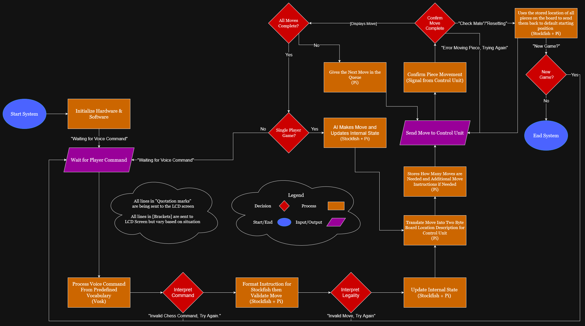

# Detailed Design for Processing Unit

This document delineates the objectives of a comprehensive system design. Upon reviewing this design, the reader should have a clear understanding of:

- How the specific subsystem integrates within the broader solution
- The constraints and specifications relevant to the subsystem
- The rationale behind each crucial design decision
- The procedure for constructing the solution

## General Requirements for the Document

The document should include:

- Explanation of the subsystem’s integration within the overall solution
- Detailed specifications and constraints specific to the subsystem
- Synopsis of the suggested solution
- Interfaces to other subsystems
- A buildable diagram*
- An operational flowchart*
- A comprehensive Bill of Materials (BOM)
- Analysis of crucial design decisions

*Note: These technical documentation elements are mandatory only when relevant to the particular subsystem.

---

## Function of the Subsystem

The **Processing Unit (PU)** functions as the central intelligence of the automated chessboard system, responsible for interpreting user input, executing game logic, and coordinating communication between all major subsystems. Implemented on a **Raspberry Pi 5**, the PU bridges human interaction and system control, translating spoken commands into actionable instructions and managing the overall flow of gameplay.

Upon startup, the PU initializes all critical software components, including the **Vosk speech recognition engine**, the **Stockfish chess engine**, and **Pychess**, as well as the communication interfaces used to interact with peripheral devices. The PU receives voice input from a USB connected microphone, leveraging Vosk to convert speech into text based commands. These commands are then analyzed and validated by PyChess to ensure compliance with chess rules before any move execution occurs. Lastly, the commands are sent to Stockfish in order to get an AI response if the game is currently single player.

Once a move has been deemed valid, the PU transmits the corresponding instruction to the **Control Unit (CU)** over a **USART** or **I²C** connection, initiating the physical relocation of pieces on the board. In parallel, the PU updates the **display interface** (connected via **I²C** or **SPI**) to provide real-time feedback to the user, including board state, game status, and system notifications.

Throughout gameplay, the PU maintains the internal representation of the chessboard, tracks both player and AI turns, and manages synchronization between speech input, motion execution, and display updates. Acting as the coordination hub of the system, the Processing Unit ensures that all subsystems operate harmoniously, maintaining a seamless and interactive chess experience from command recognition to move completion.

---

## Specifications and Constraints

The **Processing Unit (PU)** shall act as the system’s central controller, implemented on a **Raspberry Pi**, and shall perform speech recognition, board-state management, move validation, and peripheral communication. The PU shall accept voice input from a USB microphone, interpret commands with the Vosk engine, validate moves using the Stockfish engine, forward validated commands to the Control Unit (Arduino) by a serial protocol (USART or I²C), and update the display with real-time feedback. All design decisions and operational limits shall comply with applicable U.S. electrical, safety, accessibility, and consumer product standards.

---

### Performance Specifications

* **Voice capture & processing:** The PU shall accept vocal input from the USB microphone and process it using **Vosk**. The PU shall only listen after a configured wake word is detected (to protect privacy and reduce false captures).
* **Recognition accuracy & notation support:** The on-device speech recognition pipeline shall achieve a **minimum accuracy of 80%** for command recognition in typical indoor acoustic conditions, and it shall recognize algebraic chess notation and common natural-language variants (e.g., “Knight to e5”, “Bishop a4”).
* **Processing latency:** Recognized commands shall be processed and a validated move determined **within 5 seconds** of button release or the end of voice input.
* **Display responsiveness & legibility:** Move confirmations, illegal-move alerts, and game-status updates produced by the PU shall appear on the display **within 1 second** of command processing. Displayed characters shall be **≥ 10 pt** and support high-contrast text/graphics for visibility under standard indoor lighting.
* **Inter-subsystem communication:** The PU shall transmit validated move commands to the Control Unit via **USART or I²C**, using signal rates and framing that ensure reliable transfer and deterministic command execution (protocol selection shall ensure electrical and timing compatibility with the receiving Arduino).

---

### Electrical and Signal Standards Compliance

* **EMI / Emissions:** The Processing Unit shall comply with **FCC Part 15 Subpart B (Class B)** limits for conducted and radiated emissions (conducted: ~0.15–30 MHz at 66–56 dBµV decreasing with frequency; radiated: ~30–1000 MHz at 40–54 dBµV/m at 3 m) to avoid interference with consumer electronics. [1]
* **Low-voltage operation:** The PU shall operate below **50 V DC** in accordance with UL low-voltage safety thresholds. Voltage choices and wiring practices shall avoid requirements for high-voltage insulation. [2]
* **Wiring & circuit practice:** The PU’s wiring and low-voltage circuits shall follow **NEC / NFPA 70** guidance (Article 725 where applicable), providing protection against overcurrent, correct conductor sizing, and insulation rated for the circuit’s voltage. [3]
* **Materials & consumer safety:** Components and assemblies used by the PU shall avoid materials and configurations that violate **CPSC** guidance and shall use parts with documented compliance where required. [4]
* **Cabling & connectors:** All cord sets, flexible cables, and connectors serving the PU shall meet **NEC Article 400** requirements for insulation, temperature rating, minimum bend radius, grounding continuity, and secure routing to avoid mechanical damage or tripping hazards. [5]
* **Grounding & protection:** Grounding, bonding, and circuit-level protections for the PU shall follow **OSHA 29 CFR 1910 Subpart S** to minimize electric-shock hazards; exposed conductive parts shall be appropriately bonded and protected. [6]
* **Safety labeling:** User-facing enclosures, ports, and power interfaces associated with the PU shall carry **ANSI Z535.4**-compliant safety labels where hazards exist (power indicators, service access, etc.). [7]

---

### Environmental and Safety Constraints

* **Surface temperature:** External surfaces of PU enclosures shall remain ≤ **104 °F (40 °C)** during continuous operation to prevent burns or material degradation, consistent with **UL 94** flammability guidance and **CPSC 16 CFR 1505.7** thermal limits. [8][9]
* **Operating environment:** The PU shall be rated for typical indoor educational/desktop environments (ambient **0–40 °C / 32–104 °F** and non-condensing humidity ranges typical for consumer electronics) so that the Raspberry Pi and attached peripherals operate reliably.
* **Mechanical routing & strain relief:** Cabling for the microphone, display, and interconnects shall be routed and secured to avoid pinch points, sharp edges, and accidental disconnection. Cable management shall preserve minimum bend radii and use strain reliefs where appropriate per NEC guidance. [5][8]
* **Component selection & enclosures:** Enclosure materials and construction shall meet consumer product safety expectations (no sharp edges, secure fastenings), and service access shall minimize risk of accidental contact with live circuitry.

---

### Ethical, Accessibility, and Socio-Economic Considerations

* **Privacy by design:** The PU shall prioritize **on-device** processing of voice input so that raw audio is not transmitted to external services; persistent storage of raw audio shall be avoided unless explicitly consented to and secured. This reduces privacy risk from inadvertent capture of unrelated conversations.
* **Accessibility & inclusion:** User interfaces and feedback produced by the PU (voice prompts, text displays) shall conform to accessibility principles (Section 508 / WCAG guidance cited in project standards) and be tested across diverse accents and speech patterns to reduce recognition bias and support equitable use. [10][11]
* **Intellectual property & licensing:** The PU’s software stack (Vosk, Stockfish, OS, libraries) shall retain proper attribution and license compliance; open-source components shall be used and documented with their licenses to avoid IP infringement.
* **Educational accessibility & sustainability:** Component selection and cost decisions for the PU shall favor affordability and reproducibility for academic or community deployment, and the design shall facilitate repairability and reuse to reduce e-waste.
* **Speech privacy & command confirmation UI:** When listening, an LED or on-screen indicator must show active listening and a message must be provided after successful recognition.

---

## Overview of Proposed Solution

The Processing Unit (PU) will be implemented on a **Raspberry Pi 5** and organized as a small set of cooperating, open-source Python processes that together satisfy the functional, performance, safety, accessibility, and cost constraints outlined in the specification. The design intentionally uses freely available software components to keep the PU affordable and reproducible for academic and community deployment while preserving repairability, license compliance, and reuse.

### Software Architecture (Three Primary Processes)

#### 1. Vosk (Speech Recognition)
A dedicated Vosk process will consume the continuous USB microphone stream and perform on-device speech recognition. Vosk will be limited to a chess-specific grammar to improve accuracy and privacy, and raw audio will not be transmitted to external services. The system will only accept input after a configured wake word, supporting both privacy protection and reduction of false captures.

The recognition pipeline is configured to:
- Meet the **80% minimum accuracy requirement** under typical indoor conditions.
- Recognize standard algebraic notation and natural language variants such as "Pawn to a5".
- Avoid persistent storage of raw audio unless explicitly authorized and secured.

#### 2. PyChess (Board & Move Validation)
A PyChess-based process will:
- Maintain the board state.
- Validate moves.
- Identify captures and determine how many physical moves the Control Unit (Arduino) must perform.

This supports real-time responsiveness by ensuring that:
- Move confirmations, error messages, and game-state updates appear on the display within **1 second**.
- The system can detect multi-piece events (e.g., pawn capturing a knight) and generate appropriate follow-up commands.

#### 3. Stockfish (AI / Single-Player Mode)
Stockfish will run as a separate process to provide AI-generated moves for single-player games. These moves will be stored and formatted through the same pipeline used for human moves.

#### Inter-Process Organization
All major components will be implemented in **Python**, with small adapter modules transforming data to the formats required by each subsystem. Licenses for Vosk, Stockfish, the operating system, and all associated libraries will be documented to maintain compliance with open source usage requirements.

### User Interface and Feedback

The Raspberry Pi will:
- Drive the LCD to display confirmations, errors, and listening indicators.
- Present accessible feedback that adheres to Section 508 / WCAG-style guidance.

Displayed text will:
- Be at least **10 pt**, high-contrast, and readable under standard indoor lighting.
- Support diverse speech patterns and accents to minimize recognition bias.

### Inter-Subsystem Communication

After move validation:
- The Pi will format the command into a **2-byte message** for the Arduino Nano.
- Additional move messages (e.g., required for captures) will be queued and transmitted immediately afterward.
- Communication will use **USART**, with framing and signaling chosen to ensure reliable, deterministic timing compatible with Arduino.

### Board State Persistence and Automatic Reset

The PU will:
- Store the full board state, tracking each piece’s current position.
- Assign captured pieces to predefined “storage” locations along the board edge.
- Use two prewritten instruction sequences to:
  1. Move each piece to its designated off board captured location.
  2. Move all pieces back onto the board in standard chess opening positions.

This allows rapid reset and reduces manual repositioning effort.

### Performance and Timing Guarantees

The combined hardware and software system is designed so that:
- A recognized voice command produces a validated move **within 5 seconds** of end of speech.
- The display is updated **within 1 second** of move processing.

The Raspberry Pi 5 and optimized software stack ensure sufficient processing overhead to meet these requirements.

### Compliance, Privacy, and Socio-Economic Considerations

This solution supports the specified project goals by:
- Using on-device processing to protect privacy and minimize external data sharing.
- Preventing unnecessary storage of raw audio.
- Using affordable, open-source, reusable components to support cost-effective deployment and reduced e-waste.
- Addressing accessibility and user equity through software design and testing.
- Ensuring all safety, electrical, emissions, mechanical, and enclosure standards outlined elsewhere in the document are followed during construction of the final system.

---
## Interface with Other Subsystems

This section describes the inputs, outputs, and data exchanged between the Processing Unit (PU) and the other subsystems of the Automated Chess Board. The PU performs the system’s high level computation, such as move validation and speech interpretation, but it does not directly produce visible physical actions. Instead the PU relies on other units to execute those tasks. All power and signal interfaces will conform to the electrical and signaling constraints defined earlier in the Specifications and Constraints section.

### Incoming and Outgoing Power

The PU’s primary power source is the Battery Management System (BMS), which provides a regulated 5 V supply capable of delivering the required current for normal operation; this supply remains available when the board is operating from battery power alone and is intended to sustain at least one full game session [12]. The PU also functions as a distribution point for peripheral power: the microphone receives power from the PU’s USB port, which also serves as its data interface [13]; the LCD display is supplied from the Pi’s 5 V power rail [14]; and the Control Unit (Arduino Nano) is powered via a USB connection to mini USB from the PU. These power relationships centralize voltage regulation and grounding through the PU to simplify cabling and ensure consistent operating voltages across subsystems.

### Peripherals Communications

The PU exchanges data with visible peripherals. Communication methods and the expected nature of the data are described below.

#### LCD Communication
Communication between the Processing Unit and the Display Module is implemented through the Raspberry Pi’s 40-pin GPIO interface using the SPI communication protocol. The TFT module mounts directly on top of the Raspberry Pi’s GPIO header but will instead be extended using a ribbon cable, eliminating the need for external cabling and allowing both data and power to be delivered through the same connector [15]. The module operates as an SPI peripheral device, receiving pixel data, frame control commands, and refresh instruction queries over dedicated SPI lines such as SCLK, MOSI, MISO, and chip-select. The display driver IC and touch controller communicate using this bus structure, enabling the Raspberry Pi to issue display updates with low latency and predictable timing.

To enable operation, device drivers for the display must be installed on the Raspberry Pi. The manufacturer provides a downloadable driver package and installation instructions that configure the required SPI overlays and device mappings in the Raspberry Pi’s operating system. Once installed, the display is recognized as a framebuffer output device, allowing applications and the desktop environment to render directly to the screen. The physical and communication interface requires that the screen be positioned on the Raspberry Pi’s GPIO header during use, as the electrical connections for SPI, control signals, and power delivery are all made through this stacking arrangement [14].

#### Microphone Communication

The microphone connects to the PU via USB and supplies a continuous stream of digital audio samples [13]. The Raspberry Pi enumerates USB audio devices as system recording devices, allowing application-level audio APIs to capture PCM (Pulse-code modulation) audio due to the system’s built-in audio drivers [16]. These audio streams are then processed by vosk, which converts spoken input into textual commands for the game. Due to the microphone’s restricted range of movement, a USB extension cable (male to female) will be used to enable proper placement [17].

### Control Unit Communication

Communication between the Processing Unit and the Control Unit (Arduino Nano) is implemented over a dedicated UART serial link operating at 9600 bps [18]. The PU is the authoritative command source: after validating game moves, it transmits compact command packets to the Control Unit so that the CU can execute the corresponding physical actions. The Control Unit’s firmware continuously listens for incoming serial frames and converts received commands into motion and actuation sequences for piece manipulation. In some situations, such as captures, promotions, or other multi-step operations, the PU may issue multiple moves before switching to the other player's turn. The CU’s responsibility is limited to reliably executing the received commands rather than performing game rule validation. The CU will also send a confirmation back to the PU signaling that the unit has received and executed the current instruction and is ready for the next one. When transferring data between the Arduino Nano and Raspberry Pi, a logic level converter must be used between the Tx and Rx lines to ensure both devices operate at their required voltages. The Raspberry Pi 5 uses 3.3V logic on its UART pins, while the Arduino Nano expects 5V on its Rx line, making level shifting necessary to prevent damage and ensure reliable communication [19]. The wiring for the communication between the logic level converter, Raspberry Pi, and Arduino will be included in the power subsystem.

---

## Buildable Schematic 

Integrate a buildable electrical schematic directly into the document. If the diagram is unreadable or improperly scaled, the supervisor will deny approval. Divide the diagram into sections if the text and components seem too small.

The schematic should be relevant to the design and provide ample details necessary for constructing the model. It must be comprehensive so that someone, with no prior knowledge of the design, can easily understand it. Each related component's value and measurement should be clearly mentioned.

---
## Flowchart

---
## BOM

| Manufacturer | Part Number | Description | Distributor | Distributor Part Number | Qty | Price (USD) | Purchasing Website URL |
|---|---|---|---|---|---|---|---|
| Raspberry Pi Foundation | Raspberry Pi 5 – 4GB | Main processing unit (SBC) | PiShop | – | 1 | $60.00 | [Link](https://www.pishop.us/product/raspberry-pi-5-4gb/) |
| SanDisk | SDSQUA4-064G-GN6MN | 32GB microSD card for OS and software | NeweggBusiness | 9SIV05Z4847772 | 1 | $8.49 | [Link](https://www.neweggbusiness.com/Product/Product.aspx?Item=9SIV05Z4847772) |
| SparkFun | PRT-12009 | Bi-directional logic-level converter (for UART voltage shifting) | SparkFun | PRT-12009 | 1 | $4.50 | [Link](https://www.sparkfun.com/sparkfun-logic-level-converter-bi-directional.html) |
| JXMOX | J-0015 | USB A to Mini-B cable (power/programming for Arduino Nano) | Amazon | - | 1 | $3.99 | [Link](https://www.amazon.com/JXMOX-Charging-Compatible-Controller-Receiver/dp/B09DCLRYH6?dib=eyJ2IjoiMSJ9.shJPkvHWsKPPj2XvYAPBmFnnyPjItfA-_DBuJ6Sv55w3bOPZ2JsfSsp1svM_hMMC4ps6bkf4GmmnyhiX4YUJ6DXnve7f2egeTd-b5ANAcMoeeG8NEqL7ZEsoVoUmsI-Xio6-hq1TecJdcfo0Jn4osGWjksLjPPB0i_EY-XzlVMgkNa2x20nuVZC48CWCNOO7NY8V3kQYCoMOCKmwjEBs0eh-f8CCnSIPeQhoTcJPQiw.BbzjciBEm3_HrsjeOPfDdKEYTxgYmWUN7pmCO2H8w68&dib_tag=se&keywords=Mini%2BUsb%2BTo%2BUsb%2BCable&qid=1763767607&sr=8-4&th=1) |
| Adafruit | 2101 | 26-pin GPIO male to female extension for Raspberry Pi → LCD/SPI header routing | Adafruit | 2101 | 1 | $3.75 | [Link](https://www.adafruit.com/product/2101) |
| Adafruit | 862 | 26- pin GPIO Ribbon Cable for Raspberry Pi | Adafruit | 862 | 1 | $2.95 | [Link](https://www.adafruit.com/product/862) |
| ANDTOBO | 770523117560 | USB extension for microphone range | Amazon | – | 1 | $6.99 | [Link](https://tinyurl.com/zm7t2du8) |
| **Total** | - | - | - | - | - | **$90.67** | - |
### Component Justification
#### Raspberry Pi 5 (4GB)

The Raspberry Pi 5 serves as the main processing unit of the system. It provides the required CPU performance for running Vosk speech recognition, PyChess board logic, and Stockfish AI concurrently. It also offers modern power management compatibility with the power subsystem and supports Linux-based software development, meeting all performance, software, and timing constraints.

#### SanDisk microSD Card (32GB)

A microSD card is required to hold the Raspberry Pi OS, all installed software packages, speech models, and runtime logs. The 32GB capacity ensures sufficient space for all libraries, datasets, and system storage requirements.

#### Logic Level Converter

The Raspberry Pi 5 operates at 3.3V logic, while the Arduino Nano uses 5V logic. Direct UART communication would risk damage to the Pi without proper voltage shifting. The SparkFun bi-directional logic level converter enables safe, reliable voltage translation between the two systems, ensuring electrical compatibility and preventing UART damage.

#### USB Mini-B Cable (Powering Arduino Nano)

The Arduino Nano requires a Mini-B USB cable for power. This cable also simplifies integration by using a common, reversible interface without additional power supplies.

#### 26-Pin Ribbon Cable and male to female extension (LCD Display Connection)

The SPI-based LCD screen requires a flexible and organized connection to the Raspberry Pi GPIO header. The ribbon cable allows the screen to be cleanly mounted away from the Pi while maintaining correct pin routing and minimizing mechanical stress on the GPIO pins. The extension is needed because the ribbon cable is female to female and the LCD screen needs male to female.

#### USB-A Extension Cable (Microphone Range)

The microphone may need to be placed in a convenient location near the user while the Raspberry Pi remains mounted inside the board enclosure. A USB extension cable increases placement flexibility and helps ensure clear audio capture, improving recognition accuracy without relocating the entire system.

---
## Analysis

Deliver a full and relevant analysis of the design demonstrating that it should meet the constraints and accomplish the intended function. This analysis should be comprehensive and well articulated for persuasiveness.

## References
[1] U.S. Federal Communications Commission, “47 CFR Part 15, Subpart B: Unintentional Radiators,” Electronic Code of Federal Regulations, Title 47, Chapter I, Subchapter A, Part 15, Subpart B. [Online]. Available: https://www.ecfr.gov/current/title-47/chapter-I/subchapter-A/part-15/subpart-B. Accessed: Oct. 27, 2025.

[2] U.S. company UL Solutions, “Protection from Electrical Hazards,” Nov. 2024. [Online]. Available: https://www.ul.com/resources/protection-electrical-hazards. [Accessed: Oct. 28 2025].

[3] National Fire Protection Association, NFPA 70, National Electrical Code®, 2017 ed. Quincy, MA: NFPA, 2016.

[4] U.S. Consumer Product Safety Commission, “Manufacturing Best Practices,” Business Education, Manufacturing, [Online]. Available: https://www.cpsc.gov/business--manufacturing/business-education/business-guidance/BestPractices. [Accessed: Oct. 28 2025].

[5] National Fire Protection Association, NFPA 70, National Electrical Code®, 2023 ed., Quincy, MA: NFPA, 2022.

[6] U.S. Occupational Safety and Health Administration, OSHA Standards – Subpart S: Electrical, 29 CFR 1910, Washington, D.C.: OSHA, 2025.

[7] American National Standards Institute, ANSI Z535.4: Product Safety Signs and Labels, 2011 ed., Washington, DC: ANSI, 2011.

[8] U.S. Government, Rehabilitation Act of 1973, Section 508, Washington, DC, 1998.

[9] Underwriters Laboratories, UL 94: Standard for Safety of Flammability of Plastic Materials for Parts in Devices and Appliances, 5th ed., Northbrook, IL: UL, 2024.

[10] U.S. Consumer Product Safety Commission, “Maximum acceptable surface temperatures,” Code of Federal Regulations, Title 16, Part 1505.7. [Online]. Available: https://www.law.cornell.edu/cfr/text/16/1505.7. [Accessed: Oct. 28, 2025].

[11] World Wide Web Consortium. (2018). Web Content Accessibility Guidelines (WCAG) 2.1. https://www.w3.org/TR/WCAG21/

[12] Storm. (n.d.). Raspberry Pi 5/4GB. PiShop.us. https://www.pishop.us/product/raspberry-pi-5-4gb/

[13] Amazon.com: Movo MA5U Pocket Audio Microphone, Omnidirectional Pickup, 3.5mm Female TRS Headphone Port, Compatible with PC and Mac USB Drives : Electronics. (n.d.). https://www.amazon.com/dp/B08ZQSCJS3

[14] Amazon.com: Hosyond 3.5 inch 480x320 Touch screen TFT LCD SPI Display Panel for Raspberry Pi B, B+, 2B, 3B, 3B+,4B, 5 : Electronics. (n.d.). https://www.amazon.com/Hosyond-480x320-Screen-Display-Raspberry/dp/B0BJDTL9J3

[15] Industries, A. (n.d.). IDC Breakout Helper - 2x13 (26 pin). https://www.adafruit.com/product/2101

[16] WonderfulPCB. Raspberry Pi Audio Recording: Microphone Setup and alsamixer Guide. Available: Pcb, W. (2025, October 9). How to Connect Microphones and Record Audio with Raspberry Pi. Wonderful PCB. https://www.wonderfulpcb.com/blog/raspberry-pi-audio-recording-microphone-setup-and-alsamixer/

[17] Amazon.com: ANDTOBO USB Extension Cable 3.3ft, USB 3.0 Type A Male to Female Extender Cables High-Speed Data Transfer 5Gbps Compatible with Gamepad, Printer, Webcam, USB Keyboard, Flash Drive, Hard Drive : Electronics. (n.d.-b). https://tinyurl.com/zm7t2du8

[18] Understanding UART. Rohde & Schwarz. https://www.rohde-schwarz.com/us/products/test-and-measurement/essentials-test-equipment/digital-oscilloscopes/understanding-uart_254524.html

[19] SparkFun Electronics. (n.d.). SparkFun Logic Level Converter - Bi-Directional. https://www.sparkfun.com/sparkfun-logic-level-converter-bi-directional.html#content-features
