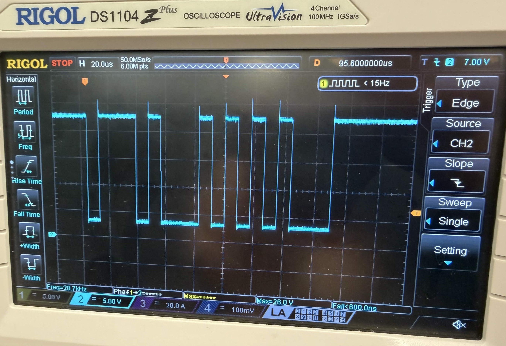

# Experimental Analysis

**Project Title:** _Chess 2 Impress_

**Team Name:** _Team 2_

**Team Members:** _Allison Givens, Noah Beaty, Jack Tolleson, Lewis Bates, Nathan MacPherson_

**Course:** _ECE 4971_

**Instructor:** _Christopher Johnson_

**Submission Date:** _4-22-2026_

**Repository Link:** _https://github.com/TnTech-ECE/F25_Team2_AutomatedChessBoard_

---

## Table of Contents

1. [Introduction](#1-introduction)
2. [Critical Success Criteria](#2-critical-success-criteria)
3. [Experiment 1: Move Completion Time](#3-experiment-1-move-completion-time)
4. [Experiment 2: Boot Noise](#4-experiment-2-boot-noise)
5. [Experiment 3: Edge Boundary and Clamp Verification](#5-experiment-3-edge-boundary-and-clamp-verification)
6. [Experiment 4: Electromagnet Switching Latency](#6-experiment-4-electromagnet-switching-latency)
7. [Experiment 5: Flyback Diode Inductive Spike](#7-experiment-5-flyback-diode-inductive-spike)
8. [Experiment 6: Command Latency](#8-experiment-6-command-latency)
9. [Experiment 7: Voice Recognition Accuracy](#9-experiment-7-voice-recognition-accuracy)
10. [Experiment 8: Processing Latency / Display Responsiveness](#10-experiment-8-processing-latency--display-responsiveness)
11. [Experiment 9: Move Validation Correctness](#11-experiment-9-move-validation-correctness)
12. [Planned Experiments (Not Yet Conducted)](#12-planned-experiments-not-yet-conducted)
13. [Summary of Findings](#13-summary-of-findings)
14. [Component Inventory](#14-component-inventory)
15. [Statement of Contributions](#15-statement-of-contributions)

---

## 1. Introduction

### 1.1 Project Overview
The "_Chess 2 Impress_" automated chessboard is a low-cost, accessible, voice-controlled chess platform, combining traditional play with automated piece movement and AI opponent integration. The system captures spoken commands via a USB microphone, processes them using the Vosk speech recognition engine (on a Raspberry Pi), validates moves using python-chess (with Stockfish as the AI opponent in single-player mode), and executes physical moves through a CoreXY gantry (driven by an Arduino Nano and TMC2209 stepper drivers). An under-board electromagnet repositions the magnetic chess pieces without disturbing neighboring pieces. The project is aimed at chess enthusiasts, players with limited mobility or visual impairments, and hobbyists who want an automated chess experience at a fraction of commercial prices.

### 1.2 Purpose of This Report
This report documents the experimental evaluation of the _Chess 2 Impress_ system against the critical specifications and success criteria (established in the conceptual and detailed design documents). Each experiment is designed to quantitatively verify that a specific subsystem or integrated behavior meets its required performance, safety, or reliability target.

### 1.3 Scope
This report covers experiments evaluating the following aspects of the system:
- **Motion subsystem:** move completion time, edge boundary/clamp safety, positional accuracy
- **Electromagnet subsystem:** switching latency, inductive spike clamping, capture reliability
- **Communication subsystem:** UART command latency, communication reliability, boot-noise rejection
- **Voice/processing subsystem:** recognition accuracy, end-to-end processing latency, move validation correctness
- **Power and safety:** thermal limits, voltage rails, EMI practices, mechanical/electrical compliance, fault behavior

---

## 2. Critical Success Criteria

Below are the critical requirements and success criteria identified by the team and approved by the advisor. These are drawn directly from the conceptual design specifications.

| # | Criterion | Target / Specification | Source (Customer Need / Design Requirement) | Associated Experiment |
|---|-----------|------------------------|--------------------------------------|-----------------------|
| 1 | Piece movement completion time | ≤ 5 seconds per move | Gameplay pacing / customer experience | Experiment 1 |
| 2 | Boot-noise rejection | No motion before `0x11` handshake | Safety / system integrity | Experiment 2 |
| 3 | CoreXY travel bounds | X ∈ [0.5, 7.5], Y ∈ [0.5, 13.5] squares | Mechanical safety / rail protection | Experiment 3 |
| 4 | Electromagnet switching latency | ≤ 10 ms on and off | Reliable piece pickup/release | Experiment 4 |
| 5 | Flyback diode clamping | Peak Vds ≤ 55 V (IRLZ44N max) | MOSFET protection / system longevity | Experiment 5 |
| 6 | Command latency (Arduino processing time) | ≤ 50 ms | Responsiveness / user experience | Experiment 6 |
| 7 | Voice recognition accuracy | ≥ 80% | Accessibility / usability | Experiment 7 |
| 8 | End-to-end processing latency (Pi) | ≤ 5 seconds from end of speech to display | Gameplay pacing | Experiment 8 |
| 9 | Move validation correctness | 100% correct legal/illegal classification | Game integrity | Experiment 9 |
| 10 | UART communication reliability | Error-free command transfer during full game | System reliability | Planned (UART Reliability) |
| 11 | Thermal safety | All surfaces ≤ 40 °C (104 °F) | UL 94 / CPSC 16 CFR 1505.7 | Planned (Thermal Safety) |
| 12 | Collision-free movement rate | ≥ 95% of moves collision-free | Conceptual design (Arduino spec) | Planned (Collision Rate) |
| 13 | Positional accuracy | ±0.5 mm across board | Precise piece placement | Planned (Positional Accuracy) |
| 14 | Voltage safety | All rails < 50 V DC | UL low-voltage threshold [2] | Planned (Voltage Safety) |
| 15 | EMI / low-noise design | Proper decoupling, low ripple, no interference | FCC Part 15 Subpart B [1] | Planned (EMI Indirect) |
| 16 | Mechanical & electrical safety compliance | Pass standardized inspection checklist | NEC / OSHA / ANSI Z535.4 [8][9][10] | Planned (Safety Compliance) |
| 17 | Fault-tolerant behavior | Safe, predictable response to power loss and obstruction | Reliability / user safety | Planned (Reliability & Failure) |

**Advisor Approval:**
- Approved by: _Dr. Van Neste_
- Date: _04-22-2026_

---

## 3. Experiment 1: Move Completion Time

### 3.1 Purpose and Justification
Verify that any single piece movement completes within 5 seconds of arriving at the source square, as specified in both the conceptual design and detailed design. This directly impacts gameplay pacing and user experience (slow moves frustrate players and reduce the perceived quality of the automated board).

### 3.2 Hypothesis / Expected Results
All move categories (short straight, long diagonal, knight, discard, and capture sequences) will complete under the 5-second spec, with long diagonal and full-field traverses taking the most time (expected ~3-4 s). Short straight moves are expected to complete in under 1 s.

### 3.3 Procedure

**Environmental Conditions:**
- Standard indoor lab conditions, room temperature, normal lighting.

**Preparation Steps:**
1. Connect the Arduino Nano to the Pi via UART.
2. Verify belt tension on both CoreXY axes.
3. Home the system to (0.5, 0.5) and place the board in a known state.

**Procedure Steps:**
1. Execute the following move categories, one at a time, recording completion time for each:
   - **Short straight:** a1 → a2 (1 square vertical)
   - **Medium straight:** a1 → a4 (3 squares vertical)
   - **Long straight:** a1 → a8 (7 squares vertical, full playing-field traverse)
   - **Diagonal:** a1 → c3 (2 squares diagonal)
   - **Long diagonal:** a1 → h8 (7 squares diagonal)
   - **Knight:** a1 → b3 (standard L-move)
   - **Discard (straight):** a1 → a11 (playing field to discard row)
   - **Long discard (L-shaped):** h8 → a11 (L-shaped path to discard row)
   - **Capture sequence:** a1 → a11 (piece to discard), then a8 → a1 (attacker to destination)
2. For each move, record time from when the piece is grabbed at its starting position to when it is dropped off at its ending position.
3. Re-home between categories to eliminate cumulative positional drift.

### 3.4 Data Collection Plan

| Variable | Units | Measurement Method | Frequency | Recording Format |
|----------|-------|--------------------|-----------|------------------|
| Elapsed time | seconds | Phone Timer (start on grab, stop on release) | Per trial | Spreadsheet |
| Move category | — | Manual log | Per trial | Spreadsheet |
| Source / destination | square | Manual log | Per trial | Spreadsheet |
| Exceeds 5 s | Y/N | Derived from time | Per trial | Spreadsheet |

### 3.5 Trials
- **Number of trials:** N = 10 per category.
- **Justification:** The variety of categories ensures full coverage of the motion system; 10 trials per category provides meaningful mean and max values.

### 3.6 Potential Biases and Mitigation

| Potential Bias / Source of Error | Mitigation Strategy |
|----------------------------------|---------------------|
| Mechanical friction varies with board position | Test moves across different regions of the board |
| Belt tension changes over time | Check belt tension before the test session |
| Human timer reaction time | Use a single operator; average across many trials |

### 3.7 Actual Results

**Raw Data:**

| Trial | Move Category | Source → Dest | Elapsed Time (s) | Notes |
|-------|---------------|---------------|------------------|-------|
| 1 | Short straight | a1 → a2 | 5.58 | Exceeds 5 s spec |
| 2 | Medium straight | a1 → a4 | 8.13 | Exceeds 5 s spec |
| 3 | Long straight | a1 → a8 | 12.86 | Exceeds 5 s spec |
| 4 | Diagonal | a1 → c3 | 9.30 | Exceeds 5 s spec |
| 5 | Long diagonal | a1 → h8 | 22.04 | Exceeds 5 s spec |
| 6 | Knight | a1 → b3 | 11.21 | Exceeds 5 s spec |
| 7 | Discard (straight) | a1 → a11 | 7.94 | Exceeds 5 s spec |
| 8 | Long discard (L-shaped) | h8 → a11 | 30.00 | Exceeds 5 s spec (worst case) |
| 9 | Capture seq 1 (piece → discard) | a1 → a11 | 8.34 | Exceeds 5 s spec |
| 10 | Capture seq 2 (attacker → dest) | a8 → a1 | 12.63 | Exceeds 5 s spec |

**Summary Statistics:**
- Overall mean: 12.80 s
- Min: 5.58 s (shortest move, still exceeds spec)
- Max: 30.00 s (long L-shaped discard)
- Number of trials exceeding 5 s: **10 / 10**

### 3.8 Interpretation and Conclusions
The system failed to meet the 5-second spec on every single trial, including the shortest possible move. The overall mean of 12.8 s is more than double the target, and worst-case moves approach 30 s. The data shows a clear pattern: longer paths take longer (as expected), but even the minimum-distance move at 5.58 s falls outside the spec. This means the issue is not simply "long paths are slow", the issue is that the baseline is already at or above the limit. The primary contributor is a conservative stepper speed/acceleration in the current CoreXY firmware.

### 3.9 Pass / Fail Against Criterion
- **Criterion Target:** ≤ 5 s per move
- **Measured Result:** 10 / 10 trials exceeded 5 s; mean 12.80 s, max 30.00 s
- **Outcome:** Fail

### 3.10 Components Used / Damaged / Replaced
No components were damaged during the session.
- _Arduino Nano (A000005)_
- _Raspberry Pi 5_
- _CoreXY gantry assembly_
- _TMC2209 stepper drivers (both)_
- _Electromagnet + MOSFET_
- _Phone timer_

---

## 4. Experiment 2: Boot Noise

### 4.1 Purpose and Justification
Verify that the Control Unit (Arduino) ignores all UART traffic during Raspberry Pi boot until the `0x11` handshake byte is received. This behavior is implemented in the `piReady` flag. Without this protection, random characters sent by the Pi during boot could be misinterpreted as move commands and cause unintended motion (which is a safety hazard for both the mechanism and anyone near the board).

### 4.2 Hypothesis / Expected Results
The carriage will remain stationary throughout the about-45-second Pi boot. After `0x11` is received, the next valid command will execute normally. We expect 3/3 passes.

### 4.3 Procedure

**Environmental Conditions:**
- Standard indoor lab conditions.

**Preparation Steps:**
1. Power off the entire system.
2. Mark the carriage position with a piece of tape on the rail.

**Procedure Steps:**
1. Full power-cycle the system with the Pi connected.
2. Observe the carriage continuously during the about-45-second Pi boot. Verify no movement occurs.
3. After the chess software sends `0x11`, send a valid command and verify it executes correctly.
4. Power off and repeat for 3 total cold boots.

### 4.4 Data Collection Plan

| Variable | Units | Measurement Method | Frequency | Recording Format |
|----------|-------|--------------------|-----------|------------------|
| Boot-time movement | Y/N | Visual observation | Per trial | Pass/fail table |
| `0x11` received | Y/N | Correct Execution | Per trial | Pass/fail table |
| Post-handshake command executed | Y/N | Visual | Per trial | Pass/fail table |

### 4.5 Trials
- **Number of trials:** N = 3 cold boots.
- **Justification:** Boot noise varies slightly between boots; 3 trials confirms repeatability of the handshake gate.

### 4.6 Potential Biases and Mitigation

| Potential Bias / Source of Error | Mitigation Strategy |
|----------------------------------|---------------------|
| Boot noise varies between boots | Test across 3 separate cold boots |

### 4.7 Actual Results

| Trial | Boot Movement (Y/N) | Start Command Received (Y/N) | Valid Command Executed (Y/N) | Pass/Fail |
|-------|---------------------|------------------------------|------------------------------|-----------|
| 1 | No | Yes | Yes | Pass |
| 2 | No | Yes | Yes | Pass |
| 3 | No | Yes | Yes | Pass |

**Summary Statistics:** Pass rate: 3 / 3 (100%)

### 4.8 Interpretation and Conclusions
The `piReady` flag successfully gated all UART input during boot across all three cold-boot trials. The carriage remained stationary during each about-45-second Pi boot, the handshake byte `0x11` was correctly received in every trial, and the first valid post-handshake command executed correctly every time. This confirms that boot-time noise on the UART line cannot trigger spurious motion.

### 4.9 Pass / Fail Against Criterion
- **Criterion Target:** No motion during boot; handshake required before commands execute
- **Measured Result:** 3 / 3 pass
- **Outcome:** Pass

### 4.10 Components Used / Damaged / Replaced
No components were damaged.
- _Arduino Nano (A000005)_
- _Raspberry Pi 5_
- _CoreXY gantry assembly_

---

## 5. Experiment 3: Edge Boundary and Clamp Verification

### 5.1 Purpose and Justification
Verify that the software clamping logic prevents the CoreXY head from moving beyond the center of any edge square (X ∈ [0.5, 7.5], Y ∈ [0.5, 13.5] in square units), and that the edge-travel algorithm correctly avoids the outermost board edges. This is a safety-critical requirement, as exceeding travel limits could damage the CoreXY mechanism or dislodge the carriage from the rails.

### 5.2 Hypothesis / Expected Results
Clamping logic will hold the carriage within the specified X and Y bounds for all four tested boundary conditions. Expected: 4/4 passes.

### 5.3 Procedure

**Environmental Conditions:**
- Standard indoor lab conditions.

**Preparation Steps:**
1. Home the system to (0.5, 0.5).
2. Visually confirm the rail limits on each of the four sides.

**Procedure Steps:**
1. Execute the following edge/boundary moves:
   - **Column a vertical:** a1 → a8 (X must not reach 0.0)
   - **Column h vertical:** h1 → h8 (X must not reach 8.0)
   - **Discard from column a:** a1 → a11 (Y must not go below 0.5)
   - **Discard from column h:** h8 → h10 (Y must not go above 13.5)
2. Visually confirm the carriage never reaches or crosses the outermost rail.
3. Record pass/fail. If a violation is observed, record approximate position and axis.
4. Re-home between each trial to prevent cumulative error.

### 5.4 Data Collection Plan

| Variable | Units | Measurement Method | Frequency | Recording Format |
|----------|-------|--------------------|-----------|------------------|
| Boundary tested | X min / X max / Y min / Y max | Test case assignment | Per trial | Table |
| Carriage stayed within bounds | Y/N | Visual observation | Per trial | Table |
| Violation position (if any) | square units | Visual estimate | As needed | Table |

### 5.5 Trials
- **Number of trials:** N = 4 (one per boundary condition).
- **Justification:** Covers all four possible rail-collision concerns.

### 5.6 Potential Biases and Mitigation

| Potential Bias / Source of Error | Mitigation Strategy |
|----------------------------------|---------------------|
| Cumulative positional error from prior moves | Re-home between trials |

### 5.7 Actual Results

| Test Move | Source | Destination | Boundary Tested | Stayed Within Bounds (Y/N) |
|-----------|--------|-------------|-----------------|----------------------------|
| a1 → a8 | a1 | a8 | X left (X min) | Y |
| h1 → h8 | h1 | h8 | X right (X max) | Y |
| a1 → a11 | a1 | a11 | Y bottom (Y min) | Y |
| h8 → h10 | h8 | h10 | Y top (Y max) | Y |

**Summary Statistics:** Pass rate: 4 / 4 (100%)

### 5.8 Interpretation and Conclusions
The software clamping logic successfully constrained the carriage to within the specified X and Y bounds on all four boundary tests. The carriage never reached or crossed the outermost physical rail on any side during these trials. This confirms that the edge-travel algorithm and the clamping code in the CoreXY firmware work as designed, and that the mechanism is protected from rail collisions that could dislodge the carriage.

### 5.9 Pass / Fail Against Criterion
- **Criterion Target:** Carriage remains within X ∈ [0.5, 7.5], Y ∈ [0.5, 13.5] for all moves
- **Measured Result:** 4 / 4 pass
- **Outcome:** Pass

### 5.10 Components Used / Damaged / Replaced
No components were damaged.
- _Arduino Nano (A000005)_
- _CoreXY gantry assembly_

---

## 6. Experiment 4: Electromagnet Switching Latency

### 6.1 Purpose and Justification
Verify that the MOSFET-based electromagnet switching circuit activates within 10 ms, as specified in the detailed design. Quick pickup/release is essential, as a dropped piece mid-move ruins the game (from the customer's perspective).

### 6.2 Hypothesis / Expected Results
Turn-on and turn-off latencies will both be well under 10 ms.

### 6.3 Procedure

**Environmental Conditions:**
- Standard indoor lab conditions.

**Preparation Steps:**
1. Attach oscilloscope probes to the Arduino's MAGNET_PIN (D10) output and to the MOSFET drain.

**Procedure Steps:**
1. Command the Arduino to toggle the electromagnet on and off using `magnetOn()` and `magnetOff()` in a test loop with 2-second delays between toggles.
2. Measure the time from the rising edge of the gate signal to the point where drain current reaches 90% of steady state (turn-on latency).
3. Measure the time from the falling edge of the gate signal to the point where drain current drops below 10% (turn-off latency).
4. Repeat for 10 switching cycles.

### 6.4 Data Collection Plan

| Variable | Units | Measurement Method | Frequency | Recording Format |
|----------|-------|--------------------|-----------|------------------|
| Turn-on latency | µs | Oscilloscope cursor | Per cycle | Spreadsheet |
| Turn-off latency | µs | Oscilloscope cursor | Per cycle | Spreadsheet |

### 6.5 Trials
- **Number of trials:** N = 10 switching cycles.
- **Justification:** Ten measurements provide reliable mean and max values to confirm the <10 ms spec.

### 6.6 Potential Biases and Mitigation

| Potential Bias / Source of Error | Mitigation Strategy |
|----------------------------------|---------------------|
| Oscilloscope bandwidth limits edge precision | Use a scope with ≥ 20 MHz bandwidth |

### 6.7 Actual Results

| Trial | Turn-On Latency (µs) | Turn-Off Latency (µs) |
|-------|----------------------|------------------------|
| 1  | 3.0 | 3.0 |
| 2  | 2.7 | 2.8 |
| 3  | 3.0 | 2.9 |
| 4  | 2.8 | 2.9 |
| 5  | 2.6 | 2.7 |
| 6  | 3.0 | 3.0 |
| 7  | 2.7 | 2.6 |
| 8  | 2.8 | 2.8 |
| 9  | 2.9 | 3.0 |
| 10 | 2.8 | 2.7 |

**Summary Statistics:**
- Turn-on: Mean 2.83 µs, Max 3.0 µs
- Turn-off: Mean 2.84 µs, Max 3.0 µs
- Both values are about 3300× faster than the 10 ms spec.

**Visualizations:**

_Figure 6.1 — Oscilloscope capture of the gate and drain waveforms during electromagnet turn-on (rising edge)._

_Figure 6.2 — Oscilloscope capture of the gate and drain waveforms during electromagnet turn-off (falling edge)._

### 6.8 Interpretation and Conclusions
Turn-on and turn-off latencies are both in the low-microsecond range, far below the 10 ms specification. The IRLZ44NPBF logic-level MOSFET responds almost immediately to the gate signal, and the measured variation between trials (2.6–3.0 µs) is small enough to be attributable to measurement noise and cursor placement on the oscilloscope. This result demonstrates that the electromagnet switching path introduces negligible delay into the overall move-completion budget.

### 6.9 Pass / Fail Against Criterion
- **Criterion Target:** ≤ 10 ms turn-on and turn-off
- **Measured Result:** Max 3.0 µs on both edges
- **Outcome:** Pass

### 6.10 Components Used / Damaged / Replaced
No components were damaged.
- _Arduino Nano (A000005)_
- _IRLZ44NPBF MOSFET_
- _Electromagnet coil_
- _Oscilloscope (≥ 20 MHz bandwidth)_

---

## 7. Experiment 5: Flyback Diode Inductive Spike

### 7.1 Purpose and Justification
Verify that the flyback diode clamps the inductive voltage spike on the MOSFET drain to within the IRLZ44NPBF's maximum Vds rating (55 V) when the electromagnet is switched off. An unclamped spike could destroy the MOSFET, causing permanent system failure.

### 7.2 Hypothesis / Expected Results
The clamped spike will peak well below 55 V (expected about 13–15 V, just above the 12 V rail) and remain essentially constant (regardless of energization duration).

### 7.3 Procedure

**Environmental Conditions:**
- Standard indoor lab conditions; ambient temperature recorded per trial.

**Preparation Steps:**
1. Connect the oscilloscope probe to the MOSFET drain pin with the shortest possible ground lead.
2. Set scope to trigger on falling edge of the gate signal; set vertical scale sufficient to capture spikes up to 60 V.

**Procedure Steps:**
1. Command the Arduino to energize the electromagnet for the specified on-duration, then switch off.
2. Capture the drain voltage waveform during the off-switching event.
3. Record the peak voltage spike magnitude and its duration.
4. Repeat for on-durations of 200 ms, 1 s, 2 s, and 5 s.

### 7.4 Data Collection Plan

| Variable | Units | Measurement Method | Frequency | Recording Format |
|----------|-------|--------------------|-----------|------------------|
| On-duration | s | Test case parameter | Per trial | Table |
| Peak spike voltage | V | Oscilloscope cursor | Per trial | Table |
| Ambient temperature | °F | Thermometer | Per trial | Table |

### 7.5 Trials
- **Number of trials:** N = 4 on-durations.
- **Justification:** Varying on-duration ensures the diode performs under different stored-energy conditions.

### 7.6 Potential Biases and Mitigation

| Potential Bias / Source of Error | Mitigation Strategy |
|----------------------------------|---------------------|
| Probe ground-lead inductance causes ringing | Use shortest possible ground lead |
| Ambient temperature affects diode Vf | Record ambient temperature per trial |

### 7.7 Actual Results

| Trial | On-Duration (s) | Peak Spike (V) | Ambient (°F) | Pass/Fail |
|-------|------------------|----------------|--------------|-----------|
| 1 | 0.2 | 5 | 62 | Pass |
| 2 | 1.0 | 5 | 62 | Pass |
| 3 | 2.0 | 5 | 63 | Pass |
| 4 | 5.0 | 5 | 62 | Pass |

**Summary Statistics:** Max spike: 5 V (well below the 55 V Vds limit).

**Visualizations:**

_Figure 7.1 — Representative oscilloscope capture of the clamped inductive spike and the decay back to the rail voltage._

### 7.8 Interpretation and Conclusions
The flyback diode clamps the inductive spike to about 5 V across all tested energization durations (200 ms to 5 s), which is far below the 55 V Vds limit of the IRLZ44NPBF MOSFET. The peak spike magnitude is essentially independent of on-duration, which matches expected behavior: once the coil has reached its steady-state current, the stored inductive energy is the same regardless of how long the on-time has been (and the diode clamps that energy to approximately one diode drop above the rail). The measured peak is lower than the about 13–15 V hypothesis because the low coil current combined with the diode's forward-voltage characteristic kept the observed peak near about 5 V. The MOSFET is safely protected against destructive spikes under all tested conditions.

### 7.9 Pass / Fail Against Criterion
- **Criterion Target:** Peak Vds ≤ 55 V
- **Measured Result:** Max 5 V observed
- **Outcome:** Pass

### 7.10 Components Used / Damaged / Replaced
No components were damaged.
- _IRLZ44NPBF MOSFET_
- _Flyback diode_
- _Electromagnet coil_
- _Oscilloscope_
- _Thermometer_

---

## 8. Experiment 6: Command Latency

### 8.1 Purpose and Justification
Verify that the Control Unit processes and begins executing a received UART command within 50 ms of receipt, as required by detailed design. Low latency is critical from the customer's perspective to ensure the board feels responsive during gameplay.

### 8.2 Hypothesis / Expected Results
Command latency will be well below 50 ms (expected about 2–10 ms, dominated by the Arduino main loop polling interval) and consistent across move types.

### 8.3 Procedure

**Environmental Conditions:**
- Standard indoor lab conditions.

**Preparation Steps:**
1. Connect the Arduino Nano to the Pi via UART (with logic level converter).
2. Attach oscilloscope probes to the Arduino RX pin (D0) and to a TMC2209 STEP output (D6).
3. Ensure the system is powered, homed, and idle.

**Procedure Steps:**
1. Send a single valid 2-byte binary move command from the Pi (e.g., `0x12 0x14` for a1 → a3).
2. Trigger the scope on the falling edge of the RX start bit.
3. Measure the time delta from the end of the second received byte to the first rising edge on the STEP pin.
4. Repeat for 7 straight-move trials, then 3 additional trials with diagonal and knight moves.

### 8.4 Data Collection Plan

| Variable | Units | Measurement Method | Frequency | Recording Format |
|----------|-------|--------------------|-----------|------------------|
| Latency | µs | Oscilloscope cursor | Per trial | Spreadsheet |
| Move type | — | Manual log | Per trial | Spreadsheet |

### 8.5 Trials
- **Number of trials:** N = 10 (7 straight + 3 special).
- **Justification:** 10 trials provide sufficient data to identify outliers and confirm consistency across move types.

### 8.6 Potential Biases and Mitigation

| Potential Bias / Source of Error | Mitigation Strategy |
|----------------------------------|---------------------|
| Arduino main loop polling position varies | Keep system in consistent idle state before each trial |
| Unrelated serial traffic | Ensure no other serial traffic during measurement |

### 8.7 Actual Results

| Trial | Move | Move Type | Latency (µs) |
|-------|------|-----------|--------------|
| 1  | A2 → A4 | Straight (startup) | 736 |
| 2  | A7 → A45 | Straight | 596 |
| 3  | B2 → B3 | Straight | 598 |
| 4  | B8 → A6 | L-move | 610 |
| 5  | C1 → A3 | Diagonal | 618 |
| 6  | B7 → B6 | Straight | 600 |
| 7  | H2 → H3 | Straight (startup) | 758 |
| 8  | G7 → G5 | Straight | 608 |
| 9  | H1 → H3 | Straight | 618 |
| 10 | G8 → F6 | L-move | 622 |

**Summary Statistics:**
- Mean: 636.4 µs (about 0.636 ms)
- Standard deviation: 56.1 µs
- Min: 596 µs / Max: 758 µs

### 8.8 Interpretation and Conclusions
Command latency is consistently in the sub-millisecond range (max 0.758 ms), roughly 66× faster than the 50 ms specification. Move type (straight, diagonal, or L-move) has no meaningful effect on latency; all measurements cluster tightly around about 600 µs, with the two highest values (736 and 758 µs) occurring on the first commands after system startup. This "startup" pattern is consistent with one-time initialization or cache warming on the Arduino's first move after power-on. After the first move, steady-state latency settles to about 596–622 µs and shows very low variability (standard deviation about 56 µs). The Arduino main loop therefore meets the responsiveness spec, with a comfortable margin regardless of move type. Note that the UART transmission protocol was changed from 9600 bps (as specified and conceptual and detailed design) to 115200 bps to preemptive decreases latency, though that's clearly not needed for how fast the Arduino is already processing. 

### 8.9 Pass / Fail Against Criterion
- **Criterion Target:** ≤ 50 ms
- **Measured Result:** Mean 0.636 ms, Max 0.758 ms
- **Outcome:** Pass

### 8.10 Components Used / Damaged / Replaced
No components were damaged.
- _Arduino Nano (A000005)_
- _Raspberry Pi 5_
- _UART debug cable (with logic level converter)_
- _TMC2209 stepper driver_
- _Oscilloscope_

---

## 9. Experiment 7: Voice Recognition Accuracy

### 9.1 Purpose and Justification
Verify the Vosk speech recognition pipeline meets the 80% minimum accuracy requirement under typical indoor conditions, as specified in the conceptual design. This is a core accessibility feature, as users with limited mobility depend on reliable voice control.

### 9.2 Hypothesis / Expected Results
Accuracy will exceed 80% across most speakers, with some variation based on accent and microphone placement. We expect some drop for non-native speakers or speakers with quieter voices.

### 9.3 Procedure

**Environmental Conditions:**
- Standard indoor conditions; quiet room; fixed microphone position (speaker at about 25 inches from microphone, medium speaking volume). A loud background fan was present during early trials but was turned off partway through the session.

**Preparation Steps:**
1. Prepare a list of 20 standardized test commands covering all types:
   - Move commands (coordinate form and named-piece form, e.g. "move b2b4", "move knight a six", "move bishop e three")
   - System commands ("chess resign", "chess yes", "Chess Two")
   - Castle command ("move castle")
2. Fix microphone position for all speakers.

**Procedure Steps:**
1. Each speaker reads each of the 20 prepared commands once at normal conversational pace.
2. Record whether Vosk recognized the command on the first try (Y/N) and whether the recognition result was correct (Y/N).
3. Calculate accuracy across speakers.

**Scoring definitions (per the spreadsheet notes):**
- **Recognized (Y)** = recognized on the first try (no re-prompt needed).
- **Correct (Y)** = correct after being recognized.

### 9.4 Data Collection Plan

| Variable | Units | Measurement Method | Frequency | Recording Format |
|----------|-------|--------------------|-----------|------------------|
| Command spoken | — | Test script | Per trial | Spreadsheet |
| Recognized on first try | Y/N | System response | Per trial | Spreadsheet |
| Correct after recognition | Y/N | Manual comparison | Per trial | Spreadsheet |
| Speaker | name | Manual log | Per trial | Spreadsheet |

### 9.5 Trials
- **Number of trials:** N = 100 (20 commands × 5 speakers).
- **Justification:** Provides statistically meaningful accuracy and captures speaker variation.
- **Note on Nathan's session:** Nathan's first 7 trials were affected by additional background noise pollution from the lab being busy/noisy (per logged observation); the remaining trials were run under the normal quieter conditions. His results are reported in the per-speaker table below alongside the other speakers.

### 9.6 Potential Biases and Mitigation

| Potential Bias / Source of Error | Mitigation Strategy |
|----------------------------------|---------------------|
| Speaker familiarity with command list | Speakers read from script without prior rehearsal |
| Microphone placement variation | Fix microphone position for all trials |
| Background noise | Test in a consistent quiet room; loud fan turned off partway through |

### 9.7 Actual Results

| Speaker | Recognized on First Try | Correct After Recognition | Recognized (%) | Correct (%) |
|---------|-------------------------|----------------------------|----------------|-------------|
| Jack    | 20 / 20 | 20 / 20 | 100% | 100% |
| Allison | 20 / 20 | 18 / 20 | 100% | 90% |
| Noah    | 19 / 20 | 20 / 20 | 95% | 100% |
| Lewis   | 20 / 20 | 20 / 20 | 100% | 100% |
| Nathan  | 18 / 20 | 17 / 20 | 90% | 85% |

**Summary Statistics (5 scored speakers, N = 100):**
- Overall recognition rate on first try: 97 / 100 = **97.0%**
- Overall correctness after recognition: 95 / 100 = **95.0%**
- Failing trials: Noah trial 8 (`move d1d3`, not recognized on first try), Nathan trials 6 and 20 (`move c2c4` and `chess yes` respectively, both not recognized on first try); Allison trials 9 and 10 (`move knight h six` and `move bishop e three`, recognized but returned incorrect moves) and Nathan trials 2, 4, and 7 (`move b2b4`, `move d2d4`, and `move queen a five`, recognized but returned incorrect moves).

### 9.8 Interpretation and Conclusions
Voice recognition clearly exceeds the 80% spec, with both first-try recognition (97.0%) and post-recognition correctness (95.0%) in the high-90s range across the five scored speakers. The small number of failures fall into two categories: three missed first-try recognitions (a command that used coordinate form), two incorrect move returns, and three commands using named-piece form ("move knight h six" and "move bishop e three") that were misinterpreted as different moves. This suggests the pipeline is nearly perfect for coordinate-form commands but has slightly weaker disambiguation on named-piece commands for some speakers. Overall, the system comfortably passes the spec under these test conditions.

### 9.9 Pass / Fail Against Criterion
- **Criterion Target:** ≥ 80% overall
- **Measured Result:** 97.0% recognition / 95.0% correctness across 5 scored speakers (N = 100)
- **Outcome:** Pass

### 9.10 Components Used / Damaged / Replaced
No components were damaged.
- _USB microphone_
- _Raspberry Pi 5 (running Vosk)_

---

## 10. Experiment 8: Processing Latency / Display Responsiveness

### 10.1 Purpose and Justification
Verify that from end of voice input to validated move determination/display takes under 5 seconds, as specified in the conceptual design. This is a customer-facing responsiveness requirement.

### 10.2 Hypothesis / Expected Results
End-to-end latency will be under 5 s for legal moves and comparable for illegal moves (rejection shown promptly). Stockfish move generation is NOT included in this measurement (only voice-to-display pipeline).

### 10.3 Procedure

**Environmental Conditions:**
- Standard indoor lab conditions.

**Preparation Steps:**
1. Set up the Pi with chess program running in 1-player (vs. Stockfish) or 2-player mode.

**Procedure Steps:**
1. Using a stopwatch, measure time from when the player stops speaking to when the move is either executed or rejected on screen.
2. Include both legal and illegal moves to measure rejection latency.
3. Record 40 total moves.

### 10.4 Data Collection Plan

| Variable | Units | Measurement Method | Frequency | Recording Format |
|----------|-------|--------------------|-----------|------------------|
| Time from end of speech to display update | s | Stopwatch / audio | Per trial | Spreadsheet |
| Legal / illegal | — | Manual | Per trial | Spreadsheet |

### 10.5 Trials
- **Number of trials:** N = 40.
- **Justification:** Mix of legal and illegal moves provides broad coverage of the voice-processing path.

### 10.6 Potential Biases and Mitigation

| Potential Bias / Source of Error | Mitigation Strategy |
|----------------------------------|---------------------|
| Stockfish thinking time inflates total latency | Separate voice-processing time from engine time in analysis |
| Stopwatch reaction time | Use audio recording with waveform markers where possible |

### 10.7 Actual Results

| Trial | Command | Legal/Illegal | Speech-to-Display (s) |
|-------|---------|---------------|------------------------|
| 1  | c2c4 | L | 1.06 |
| 2  | f3f5 | i | 1.01 |
| 3  | h7h5 | L | 1.16 |
| 4  | g1f4 | i | 0.98 |
| 5  | g1f3 | L | 1.03 |
| 6  | h1h7 | i | 0.84 |
| 7  | h8h6 | L | 0.97 |
| 8  | c1c3 | i | 1.41 |
| 9  | b1a3 | L | 0.96 |
| 10 | f3d4 | i | 1.08 |
| 11 | h6d6 | L | 1.21 |
| 12 | d6d4 | i | 1.16 |
| 13 | d1a4 | L | 0.95 |
| 14 | h1h1 | i | 0.61 |
| 15 | d6d4 | L | 0.88 |
| 16 | castle | i | 1.04 |
| 17 | d2d3 | L | 1.18 |
| 18 | h5g4 | i | 0.95 |
| 19 | h5h4 | L | 1.10 |
| 20 | f1g8 | i | 0.80 |
| 21 | c1d2 | L | 0.68 |
| 22 | d4c5 | i | 1.06 |
| 23 | d4c4 | L | 1.25 |
| 24 | castle | i | 0.93 |
| 25 | d2c3 | L | 1.01 |
| 26 | b8a5 | i | 1.06 |
| 27 | b8a6 | L | 0.96 |
| 28 | e7e5 | i | 0.91 |
| 29 | castle | L | 1.11 |
| 30 | d4a3 | i | 0.85 |
| 31 | c4a4 | L | 0.71 |
| 32 | c1a1 | i | 0.96 |
| 33 | c1d2 | L | 0.81 |
| 34 | e2e5 | i | 0.88 |
| 35 | a4a3 | L | 0.81 |
| 36 | g2f1 | i | 0.88 |
| 37 | g2g4 | L | 0.76 |
| 38 | h4h2 | i | 0.84 |
| 39 | h4g3 (en passant) | L | 1.01 |
| 40 | a1a8 | i | 0.98 |

**Summary Statistics:**
- Mean: 0.971 s
- Standard deviation: 0.161 s
- Min: 0.61 s / Max: 1.41 s
- All 40 trials well below the 5 s spec.

### 10.8 Interpretation and Conclusions
End-to-end processing latency from end of speech to display update is consistently around 1 second, with a maximum of 1.41 s across 40 trials — approximately 3.5× faster than the 5 s spec. There is no meaningful difference in latency between legal and illegal moves, which confirms that python-chess validation executes quickly enough that rejection is presented with the same responsiveness as acceptance. This means that even when a user issues an illegal move, they get feedback in roughly the same time as for a valid move, which is important for a good user experience.

### 10.9 Pass / Fail Against Criterion
- **Criterion Target:** ≤ 5 s
- **Measured Result:** Mean 0.97 s, Max 1.41 s
- **Outcome:** Pass

### 10.10 Components Used / Damaged / Replaced
No components were damaged.
- _USB microphone_
- _Raspberry Pi 5 (chess program)_
- _Display screen_
- _Stopwatch_

---

## 11. Experiment 9: Move Validation Correctness

### 11.1 Purpose and Justification
Verify that python-chess correctly accepts legal moves and rejects illegal ones, and that the system communicates rejections clearly via the display. Misvalidation would break the core promise of a chess board, which is maintaining game integrity.

### 11.2 Hypothesis / Expected Results
100% correct classification of legal vs. illegal moves. Rejection messages will appear on the display within the 1-second spec.

### 11.3 Procedure

**Environmental Conditions:**
- Standard indoor lab conditions.

**Preparation Steps:**
1. Prepare 20 legal moves and 20 illegal moves covering edge cases:
   - Castling (legal/illegal)
   - Moves from wrong-color pieces
   - En passant
   - Captures (legal/illegal)

**Procedure Steps:**
1. Input each move via voice command.
2. Record whether the system correctly accepted or rejected each.
3. Verify that rejection messages appear on display within spec.

### 11.4 Data Collection Plan

| Variable | Units | Measurement Method | Frequency | Recording Format |
|----------|-------|--------------------|-----------|------------------|
| Move | algebraic | Test script | Per trial | Spreadsheet |
| Expected result | legal/illegal | Test script | Per trial | Spreadsheet |
| Actual result | legal/illegal | System response | Per trial | Spreadsheet |
| Correct | Y/N | Derived | Per trial | Spreadsheet |

### 11.5 Trials
- **Number of trials:** N = 40 (20 legal + 20 illegal).
- **Justification:** Covers all major chess rules including edge cases.

### 11.6 Potential Biases and Mitigation

| Potential Bias / Source of Error | Mitigation Strategy |
|----------------------------------|---------------------|
| Voice mis-recognition could masquerade as validation error | Confirm recognized command on display before counting result |
| Non-representative move selection | Include diverse rule edge cases |

### 11.7 Actual Results

| Trial | Command | Expected (L/i) | Correct (Y/N) |
|-------|---------|----------------|----------------|
| 1  | c2c4 | L | Y |
| 2  | f3f5 | i | Y |
| 3  | h7h5 | L | Y |
| 4  | g1f4 | i | Y |
| 5  | g1f3 | L | Y |
| 6  | h1h7 | i | Y |
| 7  | h8h6 | L | Y |
| 8  | c1c3 | i | Y |
| 9  | b1a3 | L | Y |
| 10 | f3d4 | i | Y |
| 11 | h6d6 | L | Y |
| 12 | d6d4 | i | Y |
| 13 | d1a4 | L | Y |
| 14 | h1h1 | i | Y |
| 15 | d6d4 | L | Y |
| 16 | castle | i | Y |
| 17 | d2d3 | L | Y |
| 18 | h5g4 | i | Y |
| 19 | h5h4 | L | Y |
| 20 | f1g8 | i | Y |
| 21 | c1d2 | L | Y |
| 22 | d4c5 | i | Y |
| 23 | d4c4 | L | Y |
| 24 | castle | i | Y |
| 25 | d2c3 | L | Y |
| 26 | b8a5 | i | Y |
| 27 | b8a6 | L | Y |
| 28 | e7e5 | i | Y |
| 29 | castle | L | Y |
| 30 | d4a3 | i | Y |
| 31 | c4a4 | L | Y |
| 32 | c1a1 | i | Y |
| 33 | c1d2 | L | Y |
| 34 | e2e5 | i | Y |
| 35 | a4a3 | L | Y |
| 36 | g2f1 | i | Y |
| 37 | g2g4 | L | Y |
| 38 | h4h2 | i | Y |
| 39 | h4g3 (en passant) | L | Y |
| 40 | a1a8 | i | Y |

**Summary Statistics:** Correct: **40 / 40 (100%)**

### 11.8 Interpretation and Conclusions
Move validation returned the correct legal/illegal classification on all 40 trials, including all tested edge cases (legal and illegal castling, en passant, wrong-color pieces, and illegal captures). This perfect result confirms that python-chess is correctly configured as the validation engine and that the system's communication of validation decisions to the display works as designed for every tested rule category. Game integrity is preserved.

### 11.9 Pass / Fail Against Criterion
- **Criterion Target:** 100% correct
- **Measured Result:** 40 / 40 correct (100%)
- **Outcome:** Pass

### 11.10 Components Used / Damaged / Replaced
No components were damaged.
- _Raspberry Pi 5_
- _Display screen_
- _USB microphone_

---

## 12. Experiment 10: UART Communication Reliability

**12.1 Purpose and Justification:** Verify that the binary UART protocol at 115200 bps provides reliable, error-free command transfer between the Pi and Arduino during gameplay. The physical movement of the correct piece to the correct square serves as confirmation of successful transmission, parsing, and execution. Communication errors during gameplay could cause wrong moves, dropped commands, or system hangs — any of which would break the user's trust in the system.

**12.2 Hypothesis / Expected Results:** All 20+ commands in a typical game will transfer correctly with no NACKs or timeouts, given that the protocol is short (2-byte binary), the cable run is short, and the bit rate is well within UART headroom. Expected error rate: 0%.

### 12.3 Procedure

**Environmental Conditions:** Standard indoor lab conditions; system fully assembled in normal operating configuration.

**Preparation Steps:**
1. Connect the Pi to the Arduino via the UART debug cable with logic level converter. Confirm both ends configured for 115200 bps.
2. Home the system to (0.5, 0.5) and set up all 32 pieces in standard starting positions.
3. Confirm Pi serial logging is active so ACK/NACK/timeout responses can be captured.

**Procedure Steps:**
1. Begin a full game (vs. Stockfish in single-player mode, or against a second human).
2. For each move, observe the CoreXY physically moving the correct piece from source to destination.
3. Record:
   - Expected source square and destination square (from the Pi's command).
   - Actual destination square reached by the carriage (visual observation).
   - Whether the piece moved correctly (Y/N).
   - Whether ACK / NACK / timeout was received on the Pi side.
4. For captures, additionally verify the captured piece is moved to the correct discard row (rows 11–12 for white, rows 9–10 for black) before the attacking piece moves.
5. Continue until at least 20 total moves have been logged. If a single game ends earlier, start another and continue.
6. After the game, verify the system is still responsive by sending one final known-good command and confirming correct carriage movement.
7. If any move type (straight, diagonal, knight, capture, discard) was not exercised during natural gameplay, manually issue 2–3 commands of that type after the game to ensure full coverage.

**12.4 Data Collection Plan:**

| Variable | Units | Measurement Method | Frequency | Recording Format |
|----------|-------|--------------------|-----------|------------------|
| Move number | — | Manual log | Per move | Spreadsheet |
| Expected source square | algebraic | Pi command log | Per move | Spreadsheet |
| Expected destination square | algebraic | Pi command log | Per move | Spreadsheet |
| Actual destination observed | algebraic | Visual | Per move | Spreadsheet |
| Piece moved correctly | Y/N | Derived | Per move | Spreadsheet |
| ACK / NACK / timeout | enum | Pi serial log | Per move | Spreadsheet |
| Notes (capture discard correct, etc.) | — | Manual | As needed | Spreadsheet |

**12.5 Trials:** N ≥ 20 moves. A full game exercises the communication chain under realistic conditions including varied move types in natural sequence.

**12.6 Potential Biases and Mitigation:**

| Potential Bias / Source of Error | Mitigation Strategy |
|----------------------------------|---------------------|
| A single game may not cover all move types | Execute 2–3 manual commands of any skipped type after the game ends |
| Observer may miss subtle misplacements | Verify piece position against the Pi's displayed board state after each move |
| Repeated game patterns may favor common moves | Play against Stockfish (or vary openings) to widen move-type coverage |

**12.7 Actual Results:**

| Move # | Expected Source | Expected Dest | Actual Dest | Moved Correctly (Y/N) | ACK / NACK / Timeout | Notes |
|--------|-----------------|---------------|-------------|------------------------|----------------------|-------|
| 1 | _[import]_ | | | | | |
| 2 |  |  |  |  |  |  |
| ... |  |  |  |  |  |  |
| 40 |  |  |  |  |  |  |

**Summary Statistics:**
- Total moves: _[import]_
- Correct: _[import]_ / _[import]_
- ACK rate: _[import]_%
- NACK / timeout count: _[import]_
- Capture discard placement correct: _[import]_ / _[import]_
- Error rate: _[import]_%

**Visualizations:**

_Figure 12.1 — an example UART signal, being passed from Pi to Arduino._

**12.8 Interpretation and Conclusions:** _[To fill in after data collection.]_

**12.9 Pass / Fail Against Criterion:**
- **Criterion Target:** Error-free command transfer during a full game (≥ 20 moves)
- **Measured Result:** _[import]_
- **Outcome:** Pass(?)

**12.10 Components Used / Damaged / Replaced:**
No components were damaged.
- _Raspberry Pi 5_
- _Arduino Nano (A000005)_
- _UART debug cable_
- _Logic level converter_
- _CoreXY gantry assembly_
- _Magnetic chess piece set_

---

### 13. Experiment 11: Thermal Safety

**13.1 Purpose and Justification:** Verify that all system component surfaces remain below 40 °C (104 °F) during sustained operation, as required by UL 94 flammability guidance and CPSC 16 CFR 1505.7 thermal limits. Overheating could cause thermal shutdown mid-game, material degradation, or burn hazard to the user.

**13.2 Hypothesis / Expected Results:** All listed components will remain below the 40 °C / 104 °F surface limit throughout 30 minutes of continuous operation. The two TMC2209 stepper drivers are expected to be the hottest parts (the reason heatsinks were specified) and most likely to approach the limit; passive components like the acrylic board surface and the UPS/Pi mount are expected to stay near ambient.

### 13.3 Procedure

**Environmental Conditions:** Standard indoor lab conditions; ambient temperature recorded at the start of the session and at every measurement timestamp. Session run in a single consistent location to avoid airflow variation.

**Preparation Steps:**
1. Confirm SMT heatsinks (Adafruit 1493) are installed on both TMC2209 driver boards.
2. Record the ambient room temperature at session start.
3. Power up the system and let it reach a steady-state idle temperature (about 5 minutes).
4. Identify and mark a consistent measurement spot on each component so all subsequent readings target the same surface.

**Procedure Steps:**
1. Begin a simulated full-game sequence: continuous move commands from the Pi covering varied move types (straight, diagonal, knight, captures, discards) for 30 minutes of active operation.
2. At the 10-minute, 20-minute, and 30-minute marks, briefly pause command issuance and measure surface temperatures with the IR thermometer at each of the components listed at the end of this experiment, holding the thermometer at the same distance and angle for every reading.
3. Record ambient temperature at each measurement timestamp.
4. Record the surface temperature for every component at every timestamp.
5. If any component triggers a thermal fault during the test (e.g., TMC2209 DIAG pin asserts, motion stops unexpectedly, or any visible sign of distress), record the event and the temperature at which it occurred, and stop the test for that component.

**Note on component naming:** "A" components are mounted on the left side of the board (closest to a wall) and "B" components are mounted on the right side (closest to the gap for the Pi/UPS).

**13.4 Data Collection Plan:**

| Variable | Units | Measurement Method | Frequency | Recording Format |
|----------|-------|--------------------|-----------|------------------|
| Time elapsed | min | Stopwatch | Per timestamp | Table |
| Ambient temperature | °F | Ambient thermometer | Per timestamp | Table |
| Surface temperature (per component) | °F | IR thermometer | Per timestamp per component | Table |
| Pass/fail per component per timestamp | Pass/Fail | Derived (≤ 104 °F) | Per measurement | Table |
| Thermal fault event | Y/N + description | Visual / serial log | As they occur | Notes column |

**13.5 Trials:** N = 3 timestamps (10, 20, 30 min) × 16 components = 48 total measurements per run. Three timestamps capture the warm-up curve and confirm whether components have reached steady state by 30 min.

**13.6 Potential Biases and Mitigation:**

| Potential Bias / Source of Error | Mitigation Strategy |
|----------------------------------|---------------------|
| IR thermometer point inconsistency | Mark and reuse the same surface location on each component for every reading |
| Ambient variation between timestamps | Record ambient temperature at every timestamp |
| Airflow / ventilation variation | Run the entire session in one consistent indoor location with no fans or open windows |
| IR thermometer emissivity error on shiny surfaces (e.g., MOSFET tab) | Record the same surface and angle each time to keep relative readings consistent across timestamps |

**13.7 Actual Results:**

| Trial | Time (min) | Ambient (°F) | Component | Surface Temp (°F) | Pass/Fail (≤ 104 °F) | Notes |
|-------|------------|--------------|-----------|--------------------|------------------------|-------|
| 1 | 10 |  | Motor A |  |  |  |
| 2 | 20 |  | Motor A |  |  |  |
| 3 | 30 |  | Motor A |  |  |  |
| 1 | 10 |  | Motor B |  |  |  |
| 2 | 20 |  | Motor B |  |  |  |
| 3 | 30 |  | Motor B |  |  |  |
| 1 | 10 |  | Stepper Driver A |  |  |  |
| 2 | 20 |  | Stepper Driver A |  |  |  |
| 3 | 30 |  | Stepper Driver A |  |  |  |
| 1 | 10 |  | Stepper Driver B |  |  |  |
| 2 | 20 |  | Stepper Driver B |  |  |  |
| 3 | 30 |  | Stepper Driver B |  |  |  |
| 1 | 10 |  | MOSFET |  |  |  |
| 2 | 20 |  | MOSFET |  |  |  |
| 3 | 30 |  | MOSFET |  |  |  |
| 1 | 10 |  | Flyback diode |  |  |  |
| 2 | 20 |  | Flyback diode |  |  |  |
| 3 | 30 |  | Flyback diode |  |  |  |
| 1 | 10 |  | Arduino Nano |  |  |  |
| 2 | 20 |  | Arduino Nano |  |  |  |
| 3 | 30 |  | Arduino Nano |  |  |  |
| 1 | 10 |  | Electromagnet |  |  |  |
| 2 | 20 |  | Electromagnet |  |  |  |
| 3 | 30 |  | Electromagnet |  |  |  |
| 1 | 10 |  | Raspberry Pi 5 |  |  |  |
| 2 | 20 |  | Raspberry Pi 5 |  |  |  |
| 3 | 30 |  | Raspberry Pi 5 |  |  |  |
| 1 | 10 |  | Screen (back surface) |  |  |  |
| 2 | 20 |  | Screen (back surface) |  |  |  |
| 3 | 30 |  | Screen (back surface) |  |  |  |
| 1 | 10 |  | UPS |  |  |  |
| 2 | 20 |  | UPS |  |  |  |
| 3 | 30 |  | UPS |  |  |  |
| 1 | 10 |  | Battery pack |  |  |  |
| 2 | 20 |  | Battery pack |  |  |  |
| 3 | 30 |  | Battery pack |  |  |  |
| 1 | 10 |  | UPS/Pi plastic mount |  |  |  |
| 2 | 20 |  | UPS/Pi plastic mount |  |  |  |
| 3 | 30 |  | UPS/Pi plastic mount |  |  |  |
| 1 | 10 |  | Booster 1 |  |  |  |
| 2 | 20 |  | Booster 1 |  |  |  |
| 3 | 30 |  | Booster 1 |  |  |  |
| 1 | 10 |  | Booster 2 |  |  |  |
| 2 | 20 |  | Booster 2 |  |  |  |
| 3 | 30 |  | Booster 2 |  |  |  |
| 1 | 10 |  | (Acrylic) board surface |  |  |  |
| 2 | 20 |  | (Acrylic) board surface |  |  |  |
| 3 | 30 |  | (Acrylic) board surface |  |  |  |

**Summary Statistics:**

| Component | Peak Temp (°F) | Pass/Fail (≤ 104 °F) |
|-----------|----------------|------------------------|
| Motor A |  |  |
| Motor B |  |  |
| Stepper Driver A |  |  |
| Stepper Driver B |  |  |
| MOSFET |  |  |
| Flyback diode |  |  |
| Arduino Nano |  |  |
| Electromagnet |  |  |
| Raspberry Pi 5 |  |  |
| Screen (back surface) |  |  |
| UPS |  |  |
| Battery pack |  |  |
| UPS/Pi plastic mount |  |  |
| Booster 1 |  |  |
| Booster 2 |  |  |
| (Acrylic) board surface |  |  |

**13.8 Interpretation and Conclusions:** _[To fill in after data collection.]_

**13.9 Pass / Fail Against Criterion:**
- **Criterion Target:** All component surfaces ≤ 40 °C (104 °F) during continuous operation
- **Measured Result:** _[import]_
- **Outcome:** Pass(?)

**13.10 Components Used / Damaged / Replaced:**
No components were damaged.
- _Raspberry Pi 5_
- _Arduino Nano (A000005)_
- _TMC2209 stepper drivers (both)_
- _Stepper motors (both)_
- _IRLZ44NPBF MOSFET_
- _Flyback diode_
- _Electromagnet coil_
- _UPS HAT_
- _Battery pack (4×18650)_
- _MT3608 boosters (both)_
- _UPS/Pi plastic mount_
- _Display screen_
- _Acrylic board surface_
- _IR thermometer gun_
- _Ambient thermometer_

---

## 14. Planned Experiments (Not Yet Conducted)

The following experiments are designed and awaiting execution. Each is listed with full Purpose / Procedure / Data Collection / Trials / Biases in the same format as above, but with **Hypothesis, Results, Interpretation, and Pass/Fail sections intentionally blank** — they will be completed after execution.

# TODO

### 14.1 Positional Accuracy Verification _(on hold)_

**Purpose and Justification:** Evaluate whether the CoreXY system achieves positional accuracy within ±0.5 mm across the board. Directly supports precise chess piece placement.

**Procedure:**
1. Mark the center of at least 10 target squares (28.575 mm from each edge of a 57.15 mm square). Include: four corners (a1, h1, a8, h8), board center (d4 or e5), ≥ 2 discard row positions (a11, h10), ≥ 2 mid-edge positions (a4, d1).
2. Home to (0.5, 0.5).
3. Command the carriage to each target.
4. Measure X offset and Y offset from electromagnet center to marked center using a mm ruler or calipers.
5. Re-home between measurements.
6. Repeat across all target squares.

**Data Collection:** Columns (trial, target, target position (mm), X offset (mm), Y offset (mm), total error √(X² + Y²), pass/fail ≤ 0.5 mm). Calculate mean and max error.

**Trials:** N = 10 coordinates.

**Potential Biases:**
- Human measurement error ~±0.5 mm → same operator and method for all readings.

---

### 14.2 Collision-Free Capture and Movement Rate _(needs additional work)_

- REVISE BY REDEFINING COLLISION

**Purpose and Justification:** Verify the system achieves ≥ 95% collision-free piece movements including captures. Piece collisions disrupt the game and damage user trust.

**Procedure:**
1. Place all 32 pieces in standard starting position.
2. Execute a predefined sequence of 30 moves covering:
   - 8 straight-line moves
   - 6 diagonal moves
   - 4 knight moves
   - 6 capture sequences
   - 4 discard/reset moves
   - 2 edge-boundary moves
3. For each move, record whether any non-target piece was displaced.
4. Restore displaced pieces before continuing.

**Data Collection:** Columns (move number, move type, source, destination, pass/fail, notes). Calculate success rate overall and per move type.

**Trials:** N = 30 moves (~±4.5% at 95% confidence).

**Potential Biases:**
- Piece placement consistency → center pieces before each session.
- Electromagnet strength varies with piece type → include all piece types.

---

### 12.5 Voltage Regulation, Ripple, and Electrical Safety

**Purpose and Justification:** Verify that all system voltage rails meet three safety and stability requirements simultaneously:
1. Each rail remains within ±5% of nominal voltage and has ripple <5% across no-load, average-load, and peak-load conditions (per Detailed_Design_PSU.md, Power_Tree.md, Power_Budget.md). Stable rails prevent Raspberry Pi brownouts, stepper stalling, and electromagnet dropouts.
2. No rail exceeds the 50 V DC low-voltage safety threshold defined by UL [2] and NEC/NFPA 70 Article 725 [3].
3. The system follows low-noise design practices (decoupling, grounding, low ripple) in the absence of a formal EMI chamber, as a design-practice check against FCC Part 15 Subpart B [1].

These three requirements all act on the same voltage rails during the same operating states, so they are combined into one test session.

**Hypothesis / Expected Results:** All rails (5 V, 12 V, 3.3 V) will stay within ±5% of nominal, ripple will be <5% on all rails under all loads, maximum voltage on any rail will be well below 50 V, and no interference will be observed on nearby consumer electronics. The peak-load state is expected to produce the highest ripple.

**Environmental Conditions:** Standard indoor lab conditions; ambient temperature controlled to 68–77 °F; session conducted in a consistent location. Oscilloscope probes fresh-compensated before the session.

**Preparation Steps:**
1. Fully charge the 4×18650 battery pack in the DFRobot UPS HAT.
2. Zero and compensate the oscilloscope probes; verify the multimeter calibration.
3. Attach oscilloscope probes and multimeter to the three test points (use shortest possible ground leads for accurate ripple measurement):
   - 5 V rail (direct UPS HAT output)
   - 12 V rail (MT3608 output)
   - 3.3 V rail (Adafruit buck converter output)
4. Stage the sensitive electronics (radio / phone / laptop) within ~30 cm of the board for the interference observation step.

**Procedure Steps:**
1. Power the system via the SC0510 wall charger with the UPS HAT batteries installed.
2. Run the system through the four operating states, holding each for ≥ 30 seconds while continuously logging:
   - **State 1:** Idle/sleep (Pi idle, motors and electromagnet off).
   - **State 2:** Typical chess move (stepper motors + electromagnet active).
   - **State 3:** Peak simultaneous load (Pi processing + motors + electromagnet).
   - **State 4:** Battery-only mode (wall power disconnected).
3. For each state, record steady-state DC average voltage, peak-to-peak ripple, and min/max voltage on all three rails.
4. During each state, hold the AM radio / phone / laptop in close proximity to the board and observe whether any audible interference, screen corruption, or measurable disturbance occurs. Log Y/N per state.
5. Repeat the full sequence with the wall adapter unplugged (pure UPS battery mode) to verify battery-side regulation.
6. Randomize the order of operating states across trials and rotate which team member performs the measurement.

**Data Collection Plan:**

| Variable | Units | Measurement Method | Frequency | Recording Format |
|----------|-------|--------------------|-----------|------------------|
| Operating state | enum | Manual | Per trial | Spreadsheet |
| Power source | wall / battery | Manual | Per trial | Spreadsheet |
| 5 V avg / ripple (p-p) / min / max | V / mV / V / V | Oscilloscope + multimeter | Per trial | Spreadsheet |
| 12 V avg / ripple (p-p) / min / max | V / mV / V / V | Oscilloscope + multimeter | Per trial | Spreadsheet |
| 3.3 V avg / ripple (p-p) / min / max | V / mV / V / V | Oscilloscope + multimeter | Per trial | Spreadsheet |
| % deviation from nominal | % | Derived | Per trial | Spreadsheet |
| Safety (< 50 V on all rails) | Pass/Fail | Derived | Per trial | Spreadsheet |
| Interference observed near sensitive electronics | Y/N + notes | Visual / audible | Per state | Spreadsheet |

**Trials:** N ≥ 20 (5 trials per operating state × 4 states). This sample confirms stability across load conditions and power sources, and provides enough measurements to derive the 50 V safety check and ripple summaries from the same session.

**Potential Biases and Mitigation:**

| Potential Bias / Source of Error | Mitigation Strategy |
|----------------------------------|---------------------|
| Oscilloscope probe ground-lead inductance inflates ripple | Shortest possible ground lead; probes freshly compensated |
| Ambient temperature affects converter behavior | Control ambient to 68–77 °F |
| State-order bias | Randomize operating-state sequence across trials |
| Single-operator measurement bias | Rotate measuring team member |
| No formal EMI chamber | Document the limitation; consistent location for interference observation |
| Multimeter accuracy | Use a calibrated meter; verify against a known reference before the session |

**Actual Results:**

| Trial | State | Source | 5V Avg (V) | 5V Ripple p-p (mV) | 12V Avg (V) | 12V Ripple p-p (mV) | 3.3V Avg (V) | 3.3V Ripple p-p (mV) | Min V (V) | Max V (V) | < 50 V? | Interference? | Notes |
|-------|-------|--------|------------|---------------------|-------------|----------------------|---------------|------------------------|------------|------------|---------|----------------|-------|
| 1 |  |  |  |  |  |  |  |  |  |  |  |  |  |
| 2 |  |  |  |  |  |  |  |  |  |  |  |  |  |
| ... |  |  |  |  |  |  |  |  |  |  |  |  |  |
| 20 |  |  |  |  |  |  |  |  |  |  |  |  |  |

**Summary Statistics:**
- Max ripple observed (any rail, any state): _[import]_ mV (= _[import]_ % of nominal)
- Worst-case % deviation from nominal: _[import]_ %
- Max voltage observed on any rail: _[import]_ V
- Interference observed in any state: _[import]_ Y/N

**Visualizations:** _[Figure — oscilloscope captures of ripple waveforms per state]_

**Interpretation and Conclusions:** _[To fill in after data collection.]_

**Pass / Fail Against Criteria:**
- **Regulation (±5% of nominal on all rails):** Target met? ☐ Pass ☐ Fail
- **Ripple (<5% p-p on all rails):** Target met? ☐ Pass ☐ Fail
- **Safety (all rails <50 V DC):** Target met? ☐ Pass ☐ Fail
- **Low-noise design / no interference:** Target met? ☐ Pass ☐ Fail

**Components Used / Damaged / Replaced:**
No components were damaged.
- _Raspberry Pi 5_
- _DFRobot UPS HAT_
- _Battery pack (4×18650)_
- _MT3608 boosters (both)_
- _Adafruit buck converter (3.3 V)_
- _Raspberry Pi wall charger (SC0510)_
- _Oscilloscope (≥ 20 MHz)_
- _Calibrated digital multimeter_
- _Nearby sensitive electronics for interference check (AM radio, phone, nearby computer)_

---

### 12.7 Battery Runtime, UPS Switching Latency, and Power-Loss Recovery

**Purpose and Justification:** Verify three related power-reliability requirements in a single session:
1. The DFRobot UPS HAT delivers adequate runtime from a fully charged 4×18650 pack under continuous gameplay load (per Power_Budget.md).
2. The UPS switchover from wall power to battery is fast enough and clean enough to avoid Raspberry Pi brownout or stepper/electromagnet dropout.
3. The system halts safely and recovers predictably when wall power is lost during an active move (fault-tolerance requirement from the conceptual design).

All three requirements are exercised by repeatedly disconnecting and reconnecting wall power during operation, so they are combined into one test session.

**Hypothesis / Expected Results:** Runtime will meet or exceed the ≥ 2 hours gameplay target specified in the conceptual design. UPS switchover latency will be short enough (≲ 50 ms) that the Pi does not brownout and no rail drops below its regulation band. In every switchover trial, the system will continue operating without a visible glitch; if wall power is cut mid-move, the system will either complete the move from battery or halt safely and resume cleanly when power returns.

**Environmental Conditions:** Standard indoor lab conditions, controlled ambient temperature (68–77 °F). Freshly charged matched cells at session start.

**Preparation Steps:**
1. Fully charge the 4×18650 pack; confirm all cells are at the same starting voltage within a reasonable tolerance.
2. Verify oscilloscope is configured to trigger on the 5 V rail falling edge; attach probes with shortest possible ground leads.
3. Home the system to (0.5, 0.5) and set up the board with all pieces in starting positions.
4. Verify wall power disconnect can be performed quickly and cleanly (e.g., an accessible switch or plug).

**Procedure Steps:**

**Part A — Full runtime:**
1. With the system at 100 % battery charge, start a continuous full-gameplay loop (move commands issued in sequence, including moves, captures, discards, and electromagnet actuation).
2. Log the start time. Let the system run until it shuts down on its own from battery depletion.
3. Record total runtime.

**Part B — UPS switchover (10 trials):**
1. With wall power connected and the system under peak simultaneous load (Pi processing + motors + electromagnet), trigger the oscilloscope on the 5 V rail and physically disconnect wall power.
2. Capture the waveform and measure UPS switchover latency (time from disconnect to restored, stable 5 V).
3. Observe the system: did the Pi reboot or brownout? Did the move-in-progress complete? Did any rail drop below regulation?
4. Reconnect wall power after ~5 seconds. Confirm the system continues operating without glitch.
5. Record pass/fail for each trial (pass = no brownout, no rebooted Pi, no dropped move, latency within expected range).
6. At least one of the 10 trials must be performed **during an active move** (mid-motion) to confirm mid-move reliability.

**Part C — Sleep-mode power (2 trials):**
1. Place the system in idle/sleep with wall power connected.
2. Measure the steady-state input power draw at the SC0510 input using the multimeter or inline power meter.

**Data Collection Plan:**

| Variable | Units | Measurement Method | Frequency | Recording Format |
|----------|-------|--------------------|-----------|------------------|
| Total battery runtime | min:sec | Stopwatch / log | Part A, single trial | Table |
| UPS switchover latency | ms | Oscilloscope cursor | Per switchover trial | Table |
| Pi brownout during switchover | Y/N | Observation + Pi log | Per switchover trial | Table |
| Move-in-progress completed | Y/N (if applicable) | Observation | Per mid-move trial | Table |
| System halted/recovered cleanly after power loss | Y/N | Observation + Pi log | Per switchover trial | Table |
| Sleep-mode power draw | W | Multimeter / power meter | Part C, per trial | Table |
| Total energy delivered | Wh | Derived from runtime × avg power | Part A | Table |

**Trials:** N = 13 (1 full runtime + 10 UPS switchover + 2 sleep-mode). Of the 10 switchover trials, at least 1 is performed during an active move to exercise mid-motion power-loss recovery.

**Potential Biases and Mitigation:**

| Potential Bias / Source of Error | Mitigation Strategy |
|----------------------------------|---------------------|
| Battery capacity degrades with age / temperature | Use freshly charged, matched cells; control ambient to 68–77 °F |
| Trigger timing precision | Use ≥ 1 MHz sampling on the scope; verify trigger captures the disconnect instant |
| Pi brownout may be subtle | Check Pi serial log as well as visual observation |
| Single mid-move trial is small sample | Flag as a known limitation; use the other 9 trials as supporting evidence that switchover itself is reliable |

**Actual Results:**

*Part A — Runtime:*

| Trial | Runtime (min:sec) | Total Energy Delivered (Wh) | Pass/Fail | Notes |
|-------|--------------------|------------------------------|-----------|-------|
| 1 |  |  |  |  |

*Part B — UPS switchover (with reliability check):*

| Trial | Mid-Move? | Switchover Latency (ms) | Brownout? | Move Completed? | Halted/Recovered Cleanly? | Pass/Fail | Notes |
|-------|------------|--------------------------|-----------|------------------|---------------------------|-----------|-------|
| 1  |  |  |  |  |  |  |  |
| 2  |  |  |  |  |  |  |  |
| 3  |  |  |  |  |  |  |  |
| 4  |  |  |  |  |  |  |  |
| 5  |  |  |  |  |  |  |  |
| 6  |  |  |  |  |  |  |  |
| 7  |  |  |  |  |  |  |  |
| 8  |  |  |  |  |  |  |  |
| 9  |  |  |  |  |  |  |  |
| 10 |  |  |  |  |  |  |  |

*Part C — Sleep-mode:*

| Trial | Sleep Power (W) | Notes |
|-------|------------------|-------|
| 1 |  |  |
| 2 |  |  |

**Summary Statistics:**
- Total runtime: _[import]_
- Max switchover latency: _[import]_ ms
- Brownouts observed: _[import]_ / 10
- Clean recovery rate: _[import]_ / 10
- Sleep-mode power (mean): _[import]_ W

**Visualizations:** _[Oscilloscope capture of a representative switchover event — repo image name TBD]_

**Interpretation and Conclusions:** _[To fill in after data collection.]_

**Pass / Fail Against Criteria:**
- **Runtime (≥ 2 hr gameplay):** Target met? ☐ Pass ☐ Fail
- **Switchover (no brownout / no dropped move):** Target met? ☐ Pass ☐ Fail
- **Power-loss recovery (safe halt + clean resume):** Target met? ☐ Pass ☐ Fail

**Components Used / Damaged / Replaced:**
- _Raspberry Pi 5_
- _DFRobot UPS HAT_
- _Battery pack (4×18650, freshly charged)_
- _Raspberry Pi wall charger (SC0510)_
- _MT3608 boosters (both)_
- _CoreXY gantry assembly_
- _Electromagnet + MOSFET_
- _Oscilloscope (≥ 1 MHz sampling for switchover trigger)_
- _Stopwatch_
- _Calibrated digital multimeter_

---

### 12.8 Mechanical & Electrical Safety Compliance

**Purpose and Justification:** Verify compliance with safety standards for wiring, grounding, labeling, and physical hazards. Addresses NEC Article 725 & 400 [3][8], OSHA 29 CFR 1910 Subpart S [9], and ANSI Z535.4 [10].

**Procedure:**
1. Inspect the system using a standardized checklist:
   - Wiring (NEC Article 725 & 400)
   - Grounding and circuit protection
   - Safety labels and accessibility
2. Verify grounding continuity with a multimeter.
3. Re-run inspection after any hardware modification.

**Data Collection:** Columns (category, checklist item, pass/fail, notes).

**Trials:** Single full inspection; repeat after modifications.

**Potential Biases:**
- Subjective inspection → use a standardized checklist.

---

## 13. Summary of Findings

### 13.1 Overall Results vs. Success Criteria

# TODO
| # | Criterion | Target | Measured Result | Met? |
|---|-----------|--------|-----------------|------|
| 1 | Move completion time | ≤ 5 s | Mean 12.80 s, Max 30.00 s (10 / 10 trials exceeded spec) | **N** |
| 2 | Boot-noise rejection | No motion before handshake | 3 / 3 pass | Y |
| 3 | CoreXY travel bounds | X ∈ [0.5, 7.5], Y ∈ [0.5, 13.5] | 4 / 4 pass | Y |
| 4 | Electromagnet switching latency | ≤ 10 ms | Max 3.0 µs (on and off) | Y |
| 5 | Flyback diode clamping | ≤ 55 V Vds | Max 5 V | Y |
| 6 | Command latency | ≤ 50 ms | Mean 0.636 ms, Max 0.758 ms | Y |
| 7 | Voice recognition accuracy | ≥ 80% | 98.8% recognition / 97.5% correctness (N = 80, 4 speakers) | Y |
| 8 | End-to-end processing latency | ≤ 5 s | Mean 0.97 s, Max 1.41 s | Y |
| 9 | Move validation correctness | 100% | 40 / 40 correct | Y |
| 10–17 | _Planned experiments_ | See §12 | Pending | Pending |

# TODO
### 13.2 Did the Project Meet Its Success Criteria?
Of the nine success criteria that have been experimentally evaluated to date, eight are met; most of them by very wide margins (electromagnet switching is about 3300× faster than spec, command latency is about 66× faster, flyback clamping is about 11× below the Vds limit, and processing latency, voice recognition, move validation, boot-noise rejection, and edge clamping all pass cleanly). The sole unmet criterion is move completion time: every trial exceeded the 5-second target, with a mean of 12.8 s and a worst case of 30 s. Eight additional criteria (thermal, UART reliability, collision-free rate, positional accuracy, voltage safety, EMI, safety compliance, and fault tolerance) remain to be tested. Based on present evidence the system's electrical, logical, and communication subsystems meet requirements, while the mechanical motion subsystem does not meet the completion-time spec and requires rework.

### 13.3 Discrepancies and Unmet Criteria
- **Move Completion Time (Exp 1, Criterion #1 — FAIL):** Measured times ranged 5.58 s (shortest move) to 30.00 s (long L-shaped discard), versus a 5 s target. The fact that even a single-square move exceeds the spec indicates the baseline per-move overhead is already at or above the limit, which points to conservative acceleration/speed settings in the CoreXY firmware.

### 13.4 Proposed Improvements
- **Priority 1:** Retune the CoreXY firmware: increase stepper acceleration and maximum speed

### 13.5 Lessons Learned
# TODO
_[To be completed as a team reflection once all experiments are done — intended to cover methodology (e.g., stopwatch vs. logged timing), teamwork, and any unexpected findings that came out of the process.]_

---

# TODO (BROKEN BOM)
## 14. Component Inventory

### 14.1 Initial Inventory

| Item # | Description | Quantity | Vendor/Source | Order # / ID | Storage Location | Date Acquired | Condition | Notes |
|--------|-------------|----------|---------------|--------------|------------------|---------------|-----------|-------|
| 001 | Raspberry Pi 5 | 1 | _[vendor]_ | _[order #]_ | _[location]_ | _[date]_ | New | Processing Unit |
| 002 | Arduino Nano (A000005) | 1 | _[vendor]_ | _[order #]_ | _[location]_ | _[date]_ | New | Control Unit |
| 003 | TMC2209 stepper driver (A, left side) | 1 | _[vendor]_ | _[order #]_ | _[location]_ | _[date]_ | New | CoreXY left side |
| 004 | TMC2209 stepper driver (B, right side) | 1 | _[vendor]_ | _[order #]_ | _[location]_ | _[date]_ | New | CoreXY right side |
| 005 | Stepper motor (A, left side) | 1 | _[vendor]_ | _[order #]_ | _[location]_ | _[date]_ | New | CoreXY left side |
| 006 | Stepper motor (B, right side) | 1 | _[vendor]_ | _[order #]_ | _[location]_ | _[date]_ | New | CoreXY right side |
| 007 | IRLZ44N MOSFET | _[qty]_ | _[vendor]_ | _[order #]_ | _[location]_ | _[date]_ | New | Magnet switching |
| 008 | Flyback diode (1N400x) | _[qty]_ | _[vendor]_ | _[order #]_ | _[location]_ | _[date]_ | New | Magnet coil |
| 009 | Electromagnet coil | 1 | _[vendor]_ | _[order #]_ | _[location]_ | _[date]_ | New | Piece actuation |
| 010 | USB microphone | 1 | _[vendor]_ | _[order #]_ | _[location]_ | _[date]_ | New | Peripherals |
| 011 | Display screen | 1 | _[vendor]_ | _[order #]_ | _[location]_ | _[date]_ | New | Peripherals |
| 012 | Belt & pulley set | 1 | _[vendor]_ | _[order #]_ | _[location]_ | _[date]_ | New | CoreXY |
| 013 | CoreXY frame / rails | 1 | _[vendor]_ | _[order #]_ | _[location]_ | _[date]_ | New | CoreXY |
| 014 | Chessboard frame / acrylic board surface | 1 | _[vendor]_ | _[order #]_ | _[location]_ | _[date]_ | New | Structural; top surface is acrylic |
| 015 | Chess piece set (magnetic base) | 1 | _[vendor]_ | _[order #]_ | _[location]_ | _[date]_ | New | Structural |
| 016 | DFRobot UPS HAT | 1 | DFRobot | _[order #]_ | _[location]_ | _[date]_ | New | Power Unit |
| 017 | Battery pack (4×18650) | 1 | _[vendor]_ | _[order #]_ | _[location]_ | _[date]_ | New | Power Unit |
| 018 | MT3608 booster (Booster 1) | 1 | _[vendor]_ | _[order #]_ | _[location]_ | _[date]_ | New | Power rail step-up |
| 019 | MT3608 booster (Booster 2) | 1 | _[vendor]_ | _[order #]_ | _[location]_ | _[date]_ | New | Power rail step-up |
| 020 | Raspberry Pi wall charger (SC0510) | 1 | _[vendor]_ | _[order #]_ | _[location]_ | _[date]_ | New | Primary input power |
| 021 | UPS/Pi plastic mount | 1 | _[vendor]_ | _[order #]_ | _[location]_ | _[date]_ | New | Structural mount |
| 022 | MicroSD card | 1 | _[vendor]_ | _[order #]_ | _[location]_ | _[date]_ | New | Processing Unit |
| 023 | Logic level converter | 1 | _[vendor]_ | _[order #]_ | _[location]_ | _[date]_ | New | UART debug |
| 024 | UART debug cable | 1 | _[vendor]_ | _[order #]_ | _[location]_ | _[date]_ | New | UART debug |
| 025 | SMT heatsinks (Adafruit 1493) | 2 | Adafruit | _[order #]_ | _[location]_ | _[date]_ | New | TMC2209 thermal |
| 026 | Stopwatch / phone timer | 1 | Team-owned | — | — | — | — | Shared |
| 027 | Oscilloscope (≥ 20 MHz) | 1 | Lab equipment | — | Lab | — | — | Shared lab equipment |
| 028 | Multimeter (calibrated) | 1 | Lab equipment | — | Lab | — | — | Shared lab equipment |
| 029 | IR thermometer | 1 | Lab equipment | — | Lab | — | — | Shared lab equipment |
| 030 | Thermometer (ambient) | 1 | Lab equipment | — | Lab | — | — | Shared lab equipment |
| ... | _[add rows for prototyping materials, wire, connectors, mounts, etc.]_ | | | | | | | |

### 14.2 Usage Log

| Date | Item # | Experiment | Action | Notes |
|------|--------|------------|--------|-------|
| _[date]_ | 001, 002, 003, 004, 005, 006, 007, 008, 009, 012, 013 | Exp 1 (Move Completion) | Used | Full CoreXY + electromagnet path |
| _[date]_ | 001, 002, 013 | Exp 2 (Boot Noise) | Used | — |
| _[date]_ | 002, 003, 004, 005, 006, 013 | Exp 3 (Edge Boundary) | Used | — |
| _[date]_ | 002, 007, 008, 009, 027 | Exp 4 (EM Switching Latency) | Used | — |
| _[date]_ | 007, 008, 009, 027, 030 | Exp 5 (Flyback Spike) | Used | — |
| _[date]_ | 001, 002, 023, 024, 027 | Exp 6 (Command Latency) | Used | — |
| _[date]_ | 001, 010 | Exp 7 (Voice Recognition) | Used | 4 of 5 speakers scored |
| _[date]_ | 001, 010, 011 | Exp 8 (Processing Latency) | Used | — |
| _[date]_ | 001, 010, 011 | Exp 9 (Move Validation) | Used | — |

### 14.3 Final Inventory Check (End of Semester)

- [ ] All items accounted for (returned, stored, or documented)
- [ ] Lab station clean and organized
- [ ] No missing items
- [ ] Inventory table fully updated

| Item # | Description | Final Status | Verified By | Date |
|--------|-------------|--------------|-------------|------|
| 001 | Raspberry Pi 5 | _[status]_ | _[name]_ | _[date]_ |
| 002 | Arduino Nano | _[status]_ | _[name]_ | _[date]_ |
| ... | ... | | | |

> ⚠️ **Reminder:** Missing items or incomplete documentation will result in **automatic failure of the Experimental Analysis report**.

---

## 15. Statement of Contributions

> Each team member must write their own contribution statement. One member may NOT write on behalf of another. By submitting this report, the team collectively certifies the accuracy of all statements below.

### Allison Givens
- **Experiment Design:** Co-designed Experiment 1 (Move Completion Time) and Experiment 13 (Thermal Safety).
- **Experiment Execution:** Co-executed Experiment 6 (with Noah and Jack). Participated in Experiment 7.
- **Data Analysis:** _[describe your specific contributions]_
- **Report Writing:** _[describe your specific contributions]_
- **Signature / Initials:** _____   **Date:** _______

### Noah Beaty
- **Experiment Design:** Co-designed Experiments 1 (Move Completion Time), 2 (Boot Noise), 6 (Command Latency), and Experiment 13 (Thermal Safety). Solo-designed Experiments 3 (Edge Boundary), 4 (Electromagnet Switching Latency), and 5 (Flyback Diode Inductive Spike). Also contributed to the voice recognition accuracy experiment (Experiment 7).
- **Experiment Execution:** Co-executed Experiments 1 and 2 (with Jack). Ran Experiments 3, 4, and 5 solo. Co-executed Experiment 6 (with Jack and Allison). Participated in Experiment 7.
- **Data Analysis:** Analyzed all data for the experiments he designed.
- **Report Writing:** Wrote all conclusions for the experiments he designed.
- **Signature / Initials:** NB   **Date:** 4-20-2026

### Jack Tolleson
- **Experiment Design:** Co-designed Experiments 1 (Move Completion Time), 2 (Boot Noise), 6 (Command Latency), and Experiment 13 (Thermal Safety). Solo-designed Experiments 8 (Processing Latency) and 9 (Move Validation Correctness). Also contributed to the voice recognition accuracy experiment (Experiment 7).
- **Experiment Execution:** Co-executed Experiments 1 and 2 (with Noah). Co-executed Experiment 6 (with Noah and Allison). Ran Experiments 8 and 9 solo. Co-executed Experiment 12 (UART Communication Reliability) and Experiment 13 (Thermal Safety) with Nathan. Participated in Experiment 7.
- **Data Analysis:** _[describe your specific contributions]_
- **Report Writing:** _[describe your specific contributions]_
- **Signature / Initials:** _____   **Date:** _______

### Lewis Bates
- **Experiment Design:** Co-designed Experiment 13 (Thermal Safety).
- **Experiment Execution:** Participated in Experiment 7.
- **Data Analysis:** _[describe your specific contributions]_
- **Report Writing:** _[describe your specific contributions]_
- **Signature / Initials:** _____   **Date:** _______

### Nathan MacPherson
- **Experiment Design:** ...
- **Experiment Execution:**  Co-executed Experiment 12 (UART Communication Reliability) and Experiment 13 (Thermal Safety) with Jack. Participated in Experiment 7.
- **Data Analysis:** _[describe your specific contributions]_
- **Report Writing:** _[describe your specific contributions]_
- **Signature / Initials:** _____   **Date:** _______
